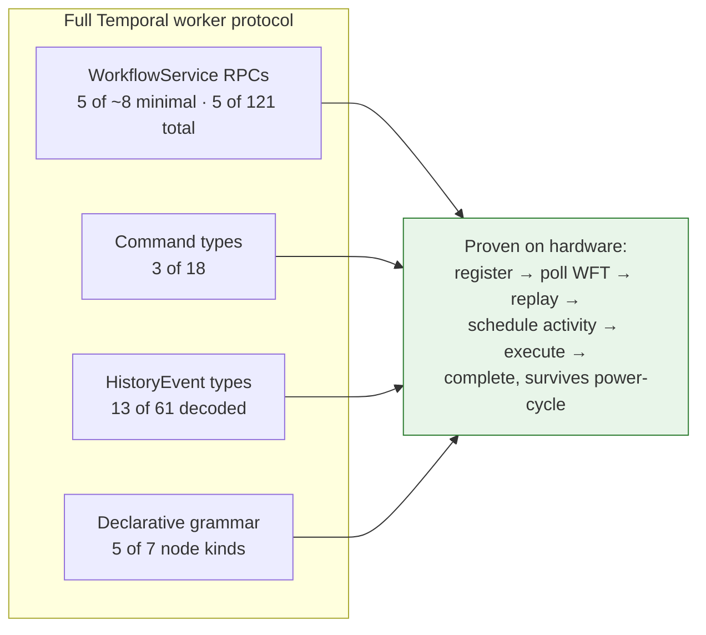
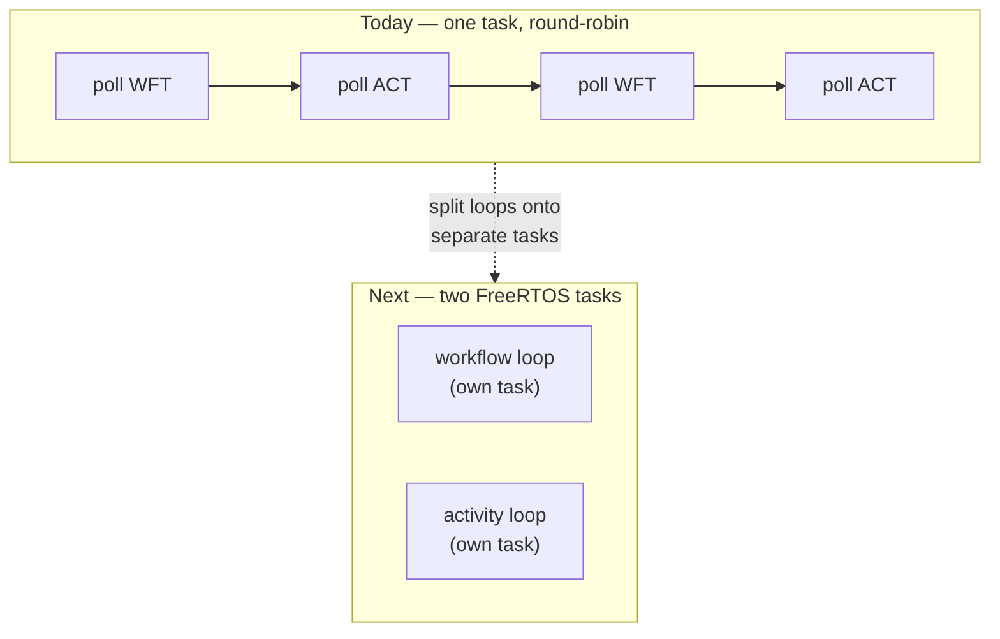
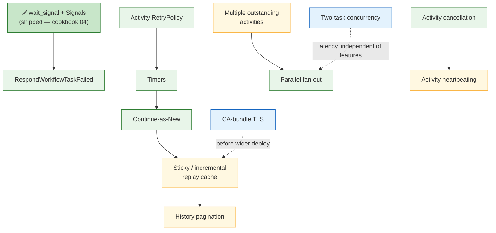

# Roadmap

`embedded-temporal` today is a small, **working** slice of the Temporal worker
protocol — enough for an ESP32-S3 to register a workflow, run an on-device
deterministic replay engine, schedule and execute its own activities, and drive a
real [Mistral Workflows](https://docs.mistral.ai/studio-api/workflows/) execution
to `COMPLETED` with no host in the loop (see the [README](README.md)). This
document maps that slice against the full protocol and lays out what to build
next.

## Why the target is "more of Temporal"

Mistral Workflows is **hosted Temporal**. The `mistralai-workflows` Python SDK
depends directly on `temporalio` (`>=1.27.2,<1.28.0`); Mistral hosts the
orchestrator (the Temporal service) and your worker code runs against its frontend
at `wf-scheduler.mistral.ai:443`. Workers speak **unmodified Temporal gRPC**; a
separate REST layer (`api.mistral.ai/v1/workflows/*`) handles management and
observability (register / execute / whoami / signals / history / schedules). This
is documented and, more importantly, *proven* — our C++ worker's `json/wf_v1`
context echo is accepted verbatim by Mistral's frontend (see
[conformance/docs/mistral-deploy-trigger.md](conformance/docs/mistral-deploy-trigger.md)).

The consequence: **a more capable worker = implementing more of the real Temporal
worker protocol, weighted by what Mistral actually exposes.** We are not chasing a
Mistral-specific dialect; we are filling in Temporal's command/event/RPC surface,
prioritized by Mistral's documented subset. The authoritative surface — 121
`WorkflowService` RPCs, 18 Command types, 61 HistoryEvent types, and Mistral's
coverage of each — was catalogued in a full protocol survey before the v1
slice was carved. Two things fall out of that research and shape every tier below:

- **Mistral's documented concept set is narrow** — Workflows, Activities,
  Executions, Events, Workers, Deployments. No child workflows, sessions, Nexus,
  search attributes, or memo. Signals, Queries, Updates, Cancel/Terminate, Reset,
  and **Continue-as-New** *do* exist (mostly at the REST layer).
- **A minimal worker needs ~8 of the 121 RPCs.** The other 113 are client
  concerns, admin, or features Mistral doesn't surface. Feature-parity with
  Temporal is a non-goal; **coverage of Mistral's subset, on an MCU, is the goal.**

## Where we are (the implemented slice)

| Surface | Implemented | Not yet | Owner |
|---|---|---|---|
| **Worker RPCs** | 5 — `PollWorkflowTaskQueue`, `RespondWorkflowTaskCompleted`, `PollActivityTaskQueue`, `RespondActivityTaskCompleted`, `RespondActivityTaskFailed` | `RespondWorkflowTaskFailed`, `RecordActivityTaskHeartbeat`, `RespondActivityTaskCanceled` (completes the minimal 8) | [`worker_loop.h`](core/include/mwf_core/worker_loop.h), [`workflow_proto_adapter.h`](core/include/mwf_core/workflow_proto_adapter.h) |
| **Commands** | **3 of 18** — `ScheduleActivityTask`, `CompleteWorkflowExecution`, `FailWorkflowExecution` | timer, signal-external, continue-as-new, cancel-activity, record-marker, … | `Command::Kind` in [`replay_engine.h`](core/include/mwf_core/replay_engine.h) |
| **HistoryEvents decoded** | **13 of 61** — workflow + workflow-task + activity-task lifecycles, **plus `TimerStarted` / `TimerFired` / `WorkflowExecutionSignaled`** | child-workflow (7), update (4), marker, search-attr, Nexus (8), external signal/cancel round-trips, … | `EventType` in [`history.h`](core/include/mwf_core/history.h) |
| **Grammar** | 5 kinds — `activity`, `sequence`, `conditional`, `wait_signal`, `complete` (determinism by construction, no MCU sandbox) | `parallel`, `timer` (**reserved — parse error today**); `agent` / `memory_op` / `try_except` / `loop` (deferred) | [`workflow_spec.h`](core/include/mwf_core/workflow_spec.h) |
| **Client** | REST trigger only (`POST /v1/workflows/{name}/execute`); gRPC `Signal` (`SignalWorkflowExecution`) is wired | gRPC `Start` / `Query` are declared-but-`TODO` stubs | [`client_ops.h`](core/include/mwf_core/client_ops.h) |
| **Payloads** | `json/wf_v1` plain (encryption / offload / compression **off**); **single history page** | paged histories (refused today), the encrypted / offloaded variants | [`contracts/spec/codec-wire-format.md`](contracts/spec/codec-wire-format.md) |
| **Replay** | one outstanding activity per workflow task; full-history re-decode each task; durable resume across reboot | multiple outstanding activities; incremental / sticky cache | [`replay_engine.h`](core/include/mwf_core/replay_engine.h) |

**A useful head-start for contributors: the *read* side runs ahead of the *write*
side.** That is exactly how **signals shipped** — the `WorkflowExecutionSignaled`
event was already decoded, so `wait_signal` only needed the grammar node,
block/resume in the engine, and the client `SignalWorkflowExecution` RPC (all
landed via cookbook 04). **Timers are the same story, still half-built:**
`TimerStarted` / `TimerFired` are decoded and golden-tested and a `RetryPolicy`
struct with working backoff helpers already exists
([`retry.h`](core/include/mwf_core/retry.h) — implemented and tested, just not
yet wired to a schedule command), but the `StartTimer` command emission and the
`timer` grammar node are missing.
That asymmetry is deliberate and it means the remaining read-ahead Tier-1 items
are smaller than they look.

---

## Recently shipped

**Signals + `wait_signal`** — the first Tier-1 item, done. A workflow blocks until
a named signal arrives, binds its payload, and continues — the canonical durable
human-in-the-loop primitive. `SignalWorkflowExecution` (client) and
`WorkflowExecutionSignaled` (event) are both wired through `workflow_spec` (the
`wait_signal` node), `replay_engine` (block/resume), `client_ops` (the signal RPC),
and the firmware BOOT button. Delivered by [cookbook 04](cookbooks/04-human-in-the-loop/)
(pause → button → resume, survives reboot while paused). One follow-up remains — the
button's cross-reboot re-arm (see the RAM/persist note below).

## Tier 1 — build next

Worker-logic-only, small proto surface, **directly used by Mistral, high value.**
These are the items a contributor should reach for first: each is a self-contained
command/event pair plus a grammar node, testable against a golden history before it
ever touches hardware. (Signals, above, was the reference example — these follow the
same shape.)

| Item | What it adds | New wire surface | Touches | Notes |
|---|---|---|---|---|
| **Activity `RetryPolicy`** | Server-driven activity retries (initial interval, backoff, max attempts) set on the schedule command, and honoring Mistral's 2 s inter-activity budget. | `RetryPolicy` field on `ScheduleActivityTaskCommandAttributes` | `retry.h` (`nextBackoffMs`/`shouldRetry` are implemented + tested; wire them up), the schedule-activity command builder | Struct + helpers already done. Mostly declarative — the server does the retrying; the worker sets policy and reports typed failures. |
| **Timers / durable sleep** | The reserved `timer` grammar node → replay-safe delays that persist through downtime. Cheap at scale, high value. | `StartTimer` command; `TimerStarted` / `TimerFired` **already decoded** | `workflow_spec` (`timer` node), `replay_engine` (emit `StartTimer`, resume on `TimerFired`), the §6 `IClock` seam | Simplest high-value primitive; read side done. **Open Q:** confirm Mistral exposes `sleep()` to workers (see below). |
| **Parallel fan-out** | The reserved `parallel` grammar node → multiple outstanding `ScheduleActivityTask` commands per workflow task (today: exactly one). | none (reuses `ScheduleActivityTask`) | `replay_engine` (join semantics; lift the one-outstanding-activity limit), `workflow_spec` (`parallel` node) | No new proto — purely lifting the "one command per tick" cap and matching N results. Cuts wall-clock for independent steps. |
| **Continue-as-New** | Atomically finish the run and start a fresh one with the same identity and empty history. | `ContinueAsNewWorkflowExecution` command + event | `replay_engine`, a `continue` / loop grammar affordance | **Critical for long-lived device workflows** — the only way to stay under Temporal/Mistral's 51,200-event / 50 MB history cap. See cross-cutting RAM section. |
| **Activity cancellation** | Workflow cancel propagates to a running activity; the activity observes it and returns a cancel result. | `RequestCancelActivityTask` command + `RespondActivityTaskCanceled` RPC | `worker_loop`, `replay_engine` (cancel scope) | Pairs with heartbeating (Tier 2) for cooperative cancel of long activities. |
| **`RespondWorkflowTaskFailed`** | Report a workflow-task failure cleanly instead of silently stalling (today a bad task just isn't answered and retries forever). | `RespondWorkflowTaskFailed` RPC | `workflow_loop`, `workflow_proto_adapter` | Completes the minimal-8 RPC set; improves diagnosability of every other item. |

---

## Tier 2 — MCU-feasible, needs new RPCs / proto or infra

Still fits an MCU, but each needs a genuinely new RPC, a distinct task-type path,
or cross-cutting state — more than a command/event pair.

| Item | What it adds | New wire surface | Notes |
|---|---|---|---|
| **Activity heartbeating** | Long device activities periodically prove liveness and can checkpoint. | `RecordActivityTaskHeartbeat` RPC | Needs a background sender (a second FreeRTOS task) issuing heartbeats while the activity body runs; also carries the cancel flag back, so it pairs with Tier-1 cancellation. |
| **Queries** | Synchronous, read-only inspection of live workflow state; never written to history. | query task path + `RespondQueryTaskCompleted` RPC | A distinct task type from workflow tasks — a new branch in the poll loop, not just a new command. |
| **Incremental / sticky replay cache** | Stop re-decoding the full ~2.56 MB history on every workflow task; cache decided state and consume only the suffix. | (worker-internal; `ResetStickyTaskQueue` to evict) | **Embedded-critical, not a Temporal "feature."** `EngineState` already carries `last_processed_event_id` and supports resuming from a history *suffix* — the durable-resume machinery is the seed of the sticky cache. See cross-cutting RAM section. |
| **Full gRPC client** | Wire the remaining `Start` / `Query` stubs in `client_ops` (`Signal` is already wired) so the device is a first-class Temporal *client*, not REST-only. | outbound `StartWorkflowExecution` / `QueryWorkflow` | Removes the REST-trigger dependency; lets a device start or query *other* workflows. |
| **Multi-page history** | Remove the single-page refusal so the device can handle histories that span pages. | `GetWorkflowExecutionHistory` paging (nextPageToken) | Interacts with the sticky cache — with incremental replay, paging is only needed on a cold resume. |
| **Workflow versioning / patching** | Branch workflow logic by change-ID so in-flight executions survive a firmware redeploy. | `RecordMarker` command (patched/GetVersion mechanism) | Reuses the same marker machinery `RecordMarker` needs anyway; moderate priority since an MCU more naturally versions by reflashing. |

---

## Tier 3 — defer or skip

Heavy, or not in Mistral's documented surface, or philosophically out of scope.

| Item | Why deferred |
|---|---|
| **Updates + validators** | Heaviest message-passing primitive: 2 new RPCs + 4 new event types + a validator convention. Revisit only if a write-and-wait use case demands it beyond `wait_signal`. |
| **Child workflows** | New `StartChildWorkflowExecution` command + 7 event types + parent/child bookkeeping. **Absent from Mistral's Core Concepts.** |
| **Search attributes / memo** | Needs a visibility store behind it; not exposed by Mistral. |
| **Sessions / Nexus** | Session-affinity routing and cross-namespace operations — irrelevant to a single sticky worker; dedicated RPC subtrees. Not exposed by Mistral. |
| **Worker Build-ID / Deployment versioning** | A dozen+ dedicated RPCs for fleet rollouts; a single-firmware MCU versions by reflashing. Temporal's experimental Build-ID method is itself being retired. |
| **Mistral extras** — AES-256-GCM payload encryption (FIELD/FULL), payload offloading (S3/GCS/Azure), connector-auth "Slots", SSE event streams, metrics endpoint | Product-layer conveniences layered on the same activity model; heavy MCU crypto/networking budget for encryption/offload, and largely orthogonal to the worker loop. |
| **Arbitrary-code workflows** | **Out of scope by design.** The declarative-grammar, determinism-by-construction approach is the embedded strategy precisely *because* there is no room for a code sandbox on an MCU. Adding one would undo the core design bet. |

---

## Cross-cutting embedded items (rank these above raw feature-parity)

Feature count is the wrong yardstick for an MCU. These items decide whether the
device survives a real, long-running workflow at all, and they should generally be
scheduled *ahead* of Tier-2/3 features.

### Persist the waiting-signal target across reboot

The device learns which execution is waiting on a `wait_signal` from the workflow
task it processes and holds that id **in RAM**. A paused workflow emits no new
task until signaled, so after a reboot the device can't re-derive it — the BOOT
button can't re-arm (the workflow is still durable and completes on any signal
that carries the execution id; see cookbook 04). Persisting the waiting
`workflow_id` to `IDurableStore` (NVS) would let the button re-arm across reboots.

### RAM survival

An ESP32-S3 holds a workflow history in a per-poll PSRAM buffer (~2.56 MB, freed
between polls); the ceiling is Temporal/Mistral's **51,200-event / 50 MB** history
cap. Three items keep the device under it:

1. **Continue-as-New** (Tier 1) — resets history to empty, the standard fix for
   unbounded growth. The single most important item for any long-lived device
   workflow.
2. **Incremental / sticky replay cache** (Tier 2) — decode the suffix, not the
   whole history, on every task. `EngineState.last_processed_event_id` and
   suffix-resume already exist in [`replay_engine.h`](core/include/mwf_core/replay_engine.h);
   promoting that from a reboot-recovery path to a per-task cache is the win.
3. **History pagination** (Tier 2) — with the sticky cache in place, paging is only
   the cold-start path, so these two are best built together.

### Two-task concurrency

Today one main task alternates the workflow and activity poll loops round-robin
([`sole_worker_policy.h`](firmware/src/sole_worker_policy.h) `RoundRobin`), which
adds a full poll cycle of latency between scheduling an activity and picking it up
— on the order of **30–40 s** of avoidable wait per workflow-task ↔ activity-task
handoff.

Splitting the two loops onto separate FreeRTOS tasks (each with its own long-poll)
removes the round-robin stall. It needs the shared TLS/transport arbiter to admit
two concurrent sessions (the [`tls_arbiter`](firmware/src/tls_arbiter.h) already
exists to mediate slots) and enough heap for two h2/TLS sessions (~24–28 KB each).

### CA-bundle TLS

Outbound TLS currently uses `setInsecure()` — no certificate validation. Replace it
with a pinned CA bundle for `wf-scheduler.mistral.ai` / `api.mistral.ai` so a
device can't be MITM'd into leaking its API key. Independent of every feature item;
should land before any wider deployment.

### Multiple outstanding activities

Lifting the "one outstanding activity per workflow task" limit is shared plumbing
between **parallel fan-out** (Tier 1) and lower activity latency generally — the
replay engine must track and match N in-flight activities instead of one
(`EngineState` today carries a single `pending_*` slot).

---

## Suggested build order

Bold green = shipped, green = Tier 1, amber = Tier 2, blue = cross-cutting. The RAM chain
(Continue-as-New → sticky cache → pagination) and the concurrency chain
(multiple-outstanding → parallel; two-task) are the two spines; timers are a quick
early win because their events are already decoded (signals shipped the same way).

## Open questions

Resolve these during execution — the research pass found no authoritative doc-site
answer, and each changes how an item is built:

1. **Does Mistral expose `sleep()` / timers to workers directly**, or only via the
   underlying `temporalio` primitives? Determines whether the `timer` grammar node
   maps to a first-class Mistral affordance or a raw Temporal command.
2. **Exact byte threshold for Mistral's payload offloading** to blob storage — sets
   the size at which the v1 `json/wf_v1` plain path stops being sufficient.
3. **Is `RETRYING_AFTER_ERROR` a real workflow-level `RetryPolicy`**, or just UX
   surfacing of activity retries? Affects whether execution-level retry is worth a
   dedicated path.
4. **Durable-agent / LLM-loop API shape** — only marketing-level language was
   found; no Core-Concepts page. Relevant if the `agent` grammar node is ever
   pursued.
5. Our live evidence already indicates Mistral's worker wire is **unmodified
   Temporal gRPC** (our raw C++ frames are accepted) — worth **confirming in
   docs** so contributors can rely on it.

---

## Contributing

The best on-ramp is a Tier-1 item whose events are already decoded (signals,
timers): add the grammar node in [`workflow_spec.h`](core/include/mwf_core/workflow_spec.h),
the command/resume logic in [`replay_engine.h`](core/include/mwf_core/replay_engine.h),
and a golden history under [`conformance/`](conformance/) — the whole thing is
host-testable before it touches a board. The frozen seams every track codes against
are in [`contracts/CONTRACTS.md`](contracts/CONTRACTS.md); the honest boundaries of
the current slice are in [docs/limitations.md](docs/limitations.md).

---

## Related docs

- [docs/architecture.md](docs/architecture.md) — the system design each roadmap item extends.
- [docs/contracts.md](docs/contracts.md) — the frozen seams (and the reserved surfaces Tier 1 fills in).
- [docs/wire-format.md](docs/wire-format.md) — the `json/wf_v1` codec, and what v2 encryption/offload/compression would change.
- [docs/mistral-compatibility.md](docs/mistral-compatibility.md) — the Mistral / Temporal surface these tiers are prioritized against.
- [docs/limitations.md](docs/limitations.md) — the honest boundaries these items move.
- [docs/esp32-compatibility.md](docs/esp32-compatibility.md) — the measured footprint/latency behind the cross-cutting RAM & concurrency items.
- [README.md](README.md) — the project overview and the proven-on-hardware run.
