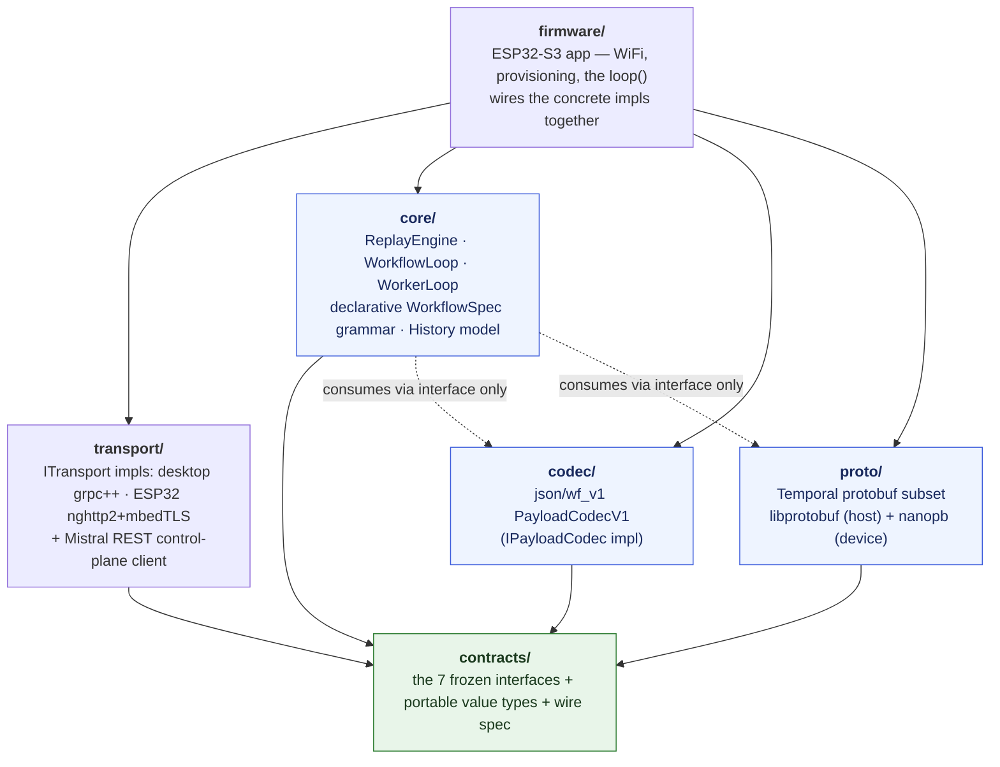

# Architecture

Technical reference for anyone extending the system — adding a step kind, a
transport, or an activity backend — and for agents working in this repo. If you
just want to run or write a workflow, start with the [README](../README.md) and
[Writing a workflow](writing-a-workflow.md).

`embedded-temporal` is a [Temporal](https://temporal.io) / [Mistral Workflows](https://docs.mistral.ai/studio-api/workflows/)
worker that runs on an ESP32-S3 microcontroller. The device registers a
workflow, long-polls the Mistral scheduler over Temporal gRPC, runs an on-device
deterministic **replay engine** to orchestrate the workflow, schedules and
executes its own activities, and completes it — no host process in the loop. The
same C++ core also runs on the desktop.

This document covers how the code is layered, how the two poll loops make one
board a complete Temporal worker, why the workflow engine is declarative rather
than a code sandbox, how desktop and device share one transport contract, and
how the layers are integration-tested against recorded golden vectors.

Read it alongside the frozen-interface spec in
[`../contracts/CONTRACTS.md`](../contracts/CONTRACTS.md) and the wire format in
[`../contracts/spec/codec-wire-format.md`](../contracts/spec/codec-wire-format.md).

---

## 1. The core idea

Mistral Workflows is durable execution built on Temporal. A worker's job is a
loop: **long-poll a task queue → do the next piece of work → report the result
back**, over and over, with all state living server-side so the worker can crash
and resume at any time. Temporal ships worker SDKs for Go/Java/TS/Python/.NET —
none for C or C++, and nothing that fits a microcontroller.

Two properties make a Temporal worker hard to shrink:

1. **Durable orchestration by replay.** A workflow's control flow is
   reconstructed by *replaying* its recorded event history. Normal SDKs do this
   by re-executing the user's workflow **code** and interposing on every
   nondeterministic call (time, random, I/O) so replay is reproducible. That
   demands a language runtime and a sandbox on the device.
2. **The wire.** Temporal is gRPC-over-HTTP/2 with protobuf; Mistral wraps
   payloads in an undocumented `json/wf_v1` envelope. Neither is trivial on an
   MCU with ~300 KB of internal SRAM.

We solve (1) by making workflows **declarative data** rather than code, and (2)
with a from-scratch, PSRAM-routed gRPC/HTTP/2 stack behind a narrow transport
seam. Everything below follows from those two decisions.

---

## 2. Layering

The repository is a stack of libraries with a strict dependency rule: **a lower
layer never depends on an upper one.** The bottom layer is nothing but frozen
interfaces; each layer above implements or consumes those interfaces, and the
firmware at the top wires concrete implementations together.



| layer | directory | depends on | what it is | Arduino? |
|---|---|---|---|---|
| **contracts** | [`contracts/`](../contracts/) | — | The seven frozen `mwf::` interfaces (`ITransport`, `IProtoCodec`, `IPayloadCodec`, `IDurableStore`, `IClock`/`IRandom`, `IActivityRegistry`) plus lib-agnostic value types (`Bytes`, `Result<T>`, `temporal::Payload`, `WorkflowContext`). No logic. | no |
| **proto** | [`proto/`](../proto/) | contracts | The Temporal protobuf message subset and its codegen: `libprotobuf` on the host, `nanopb` (static-alloc, capped) on the device. Turns typed structs ⇄ wire bytes. | no |
| **codec** | [`codec/`](../codec/) | contracts | `PayloadCodecV1` — the `json/wf_v1` payload envelope (metadata map + raw-JSON passthrough), reverse-engineered from the Mistral SDK. | no |
| **core** | [`core/`](../core/) | contracts (+ codec/proto **through their interfaces**) | The portable orchestration logic: the deterministic `ReplayEngine`, the declarative `WorkflowSpec` grammar, the two poll loops, the `History` model, `ClientOps`. Host-tested, **no Arduino, no protobuf, no HTTP**. | no |
| **transport** | [`transport/`](../transport/) | contracts | Two `ITransport` implementations (desktop grpc++ generic-stub; ESP32 vendored-nghttp2 + mbedTLS-PSRAM) plus the Mistral REST control-plane client. | device impl only |
| **firmware** | [`firmware/`](../firmware/) | all of the above | The ESP32-S3 PlatformIO application: WiFi, NVS provisioning, PSRAM/TLS setup, and the `loop()` that round-robins the two poll loops. | yes |

The "lower never depends on upper" rule means **`core` — the whole
orchestration engine — is pure portable C++17 with no Arduino, no protobuf
library, and no socket.** It talks to the outside world only through
`contracts` interfaces, so the identical `WorkflowLoop`/`WorkerLoop`/
`ReplayEngine` objects run under host unit tests, in the desktop sole-worker
binary, and on the ESP32. See [`../core/README.md`](../core/README.md).

### The seams (contracts)

Everything crosses a layer boundary as **bytes + plain value structs behind a
vtable**, never as a concrete library type. The interfaces that matter for the
data path:

- **`ITransport`** — one blocking unary gRPC call: `call(fullMethod, requestBytes,
  metadata, deadlineMs) → {grpc_status, message, responseBytes}`. `core` never
  sees HTTP/2 or a protobuf library. `DEADLINE_EXCEEDED` (status 4) on a poll is a
  **normal empty long-poll**, not an error.
- **`IProtoCodec` / the proto adapters** — typed Temporal message ⇄ protobuf
  wire bytes. In `core` this hides behind the loop-specific `IWorkerProtoAdapter`
  / `IWorkflowProtoAdapter` seams (build request bytes, parse response bytes into
  plain structs / a decoded `History`), so `core` stays protobuf-lib-free.
- **`IPayloadCodec`** — the Mistral `json/wf_v1` envelope: decode an activity
  input `Payload` into inner JSON + a `WorkflowContext`; encode a JSON result
  back into a `Payload`, echoing the run's context.
- **`IDurableStore`** — `put`/`get`/`erase`/`keys(prefix)` over an opaque
  key→bytes store that survives a power cycle. Key scheme: `exec/<runId>` =
  serialized replay state, `token/<runId>` = task token.
- **`IActivityRegistry`** — the device's actual work: `name → (jsonIn → jsonOut)`.
- **`IClock` / `IRandom`** — the determinism seams (reserved for the v1.1 timer/
  random grammar; the v1 replay walk never consults them).

The full spec, including why `IWorkflowSpec` is a JSON grammar rather than a
vtable, is [`../contracts/CONTRACTS.md`](../contracts/CONTRACTS.md).

---

## 3. The two poll loops (the sole worker)

A complete Temporal worker has two responsibilities that Temporal keeps on
**separate task queues** and that SDKs usually run as two worker types:

- a **workflow worker** — polls *workflow tasks*, decides the next Commands
  (schedule an activity, complete, fail), and responds; and
- an **activity worker** — polls *activity tasks*, runs the activity function,
  and responds with its result.

`core` implements each as a small, portable loop over `ITransport`:

| loop | header | polls | drives | responds with |
|---|---|---|---|---|
| **`WorkflowLoop`** | [`workflow_loop.h`](../core/include/mwf_core/workflow_loop.h) | `PollWorkflowTaskQueue` | the `ReplayEngine` over the delivered `History` | `RespondWorkflowTaskCompleted{commands[]}` |
| **`WorkerLoop`** | [`worker_loop.h`](../core/include/mwf_core/worker_loop.h) | `PollActivityTaskQueue` | the `IActivityRegistry` | `RespondActivityTask{Completed,Failed}` |

Each exposes `runOnce(deadlineMs)` — **one** poll→act→respond cycle — plus a
`tick()` convenience. Neither ever throws; each cycle returns a `TickOutcome`
(`Idle` / `Progressed` / `Completed` / `Failed` / `TransportError` /
`ProtocolError`) so the caller can log and back off. Both are the same portable
shape: bytes in, plain structs out, all protobuf hidden behind a proto adapter.

### One board, one queue, round-robin

The key point is that **a single microcontroller is the *sole* worker for the
whole workflow.** It hosts both the workflow and its one activity. In the
deployment the device uses, `WorkflowConfig.activity_task_queue` is left empty,
so scheduled activities land on the **workflow's own task queue** — one queue
carries workflow tasks *and* activity tasks, and the one device must serve both.

The firmware runs both loops on the **single main task**, alternating which one
polls each cycle. The scheduling decision is a tiny host-testable policy in
[`firmware/src/sole_worker_policy.h`](../firmware/src/sole_worker_policy.h):

```cpp
struct RoundRobin {
  bool workflowNext = true;         // start with the workflow loop so a fresh
  bool nextIsWorkflow() {           // run's first WorkflowTask is picked up promptly
    bool v = workflowNext; workflowNext = !workflowNext; return v;
  }
};
```

Because the two loops share **one** `EspTransport` (one h2 connection, one TLS
arbiter slot) and run on one task, they **never re-enter the transport
concurrently** — `PollActivity`, `PollWorkflow`, and the `Respond*` calls are
just different gRPC method paths multiplexed over the same connection. With a
~10 s poll deadline on each loop, a full run (WFT1 → schedule → activity → WFT2 →
complete) turns over in **~1–11 s typically** (measured), and up to ~30–40 s only
if every step lands at the far end of its poll window — it's poll cadence, not
compute (see [esp32-compatibility](esp32-compatibility.md#the-latency-model-round-robin-polling)).
The device's other TLS slot stays free for the REST control-plane calls
(whoami / register / heartbeat).

The desktop sole-worker binary
([`transport/example/sole_worker_main.cpp`](../transport/example/sole_worker_main.cpp))
runs the identical logic on one thread — the same `core` loops, with the desktop
transport and libprotobuf adapters.

### A workflow tick, end to end

Here is one complete run: a client triggers the workflow over REST, and the
device orchestrates *and* executes it. Note how the same device appears twice —
once as `WorkflowLoop` (the orchestrator) and once as `WorkerLoop` (the worker) —
and how the replay engine is re-run from scratch on every workflow task, holding
no in-RAM continuation between polls.

```mermaid
sequenceDiagram
  autonumber
  participant Client as Client (REST)
  participant Mistral as Mistral frontend<br/>(control plane + Temporal scheduler)
  participant WF as Device · WorkflowLoop<br/>(ReplayEngine + DurableStore)
  participant WK as Device · WorkerLoop<br/>(ActivityRegistry)

  Client->>Mistral: POST /v1/workflows/{name}/execute {input, task_queue}
  Note over Mistral: creates a Temporal execution,<br/>enqueues WorkflowTask #1

  WF->>Mistral: PollWorkflowTaskQueue (long-poll)
  Mistral-->>WF: WFT #1 — history[Started, WFT·Scheduled/Started]
  Note over WF: adapter decodes history → mwf_core::History<br/>SpecProvider resolves workflow_type → spec<br/>restore EngineState from exec/&lt;runId&gt;<br/>ReplayEngine.decide → step device.echo not in history<br/>⇒ ScheduleActivity, stop
  Note over WF: codec-encode input (wf_v1) · persist EngineState BEFORE responding
  WF->>Mistral: RespondWorkflowTaskCompleted [ScheduleActivityTask]
  Note over Mistral: enqueues ActivityTask on the same queue

  WK->>Mistral: PollActivityTaskQueue (long-poll)
  Mistral-->>WK: ActivityTask — device.echo(input, wf_v1)
  Note over WK: codec-decode wf_v1 → inner JSON<br/>registry.invoke("device.echo") → result JSON<br/>codec-encode result (echo same WorkflowContext)
  WK->>Mistral: RespondActivityTaskCompleted [result]
  Note over Mistral: records ActivityTaskCompleted,<br/>enqueues WorkflowTask #2

  WF->>Mistral: PollWorkflowTaskQueue (long-poll)
  Mistral-->>WF: WFT #2 — history now has ActivityTaskCompleted+result
  Note over WF: decide replays from history → bind result<br/>next step complete ⇒ CompleteWorkflowExecution
  WF->>Mistral: RespondWorkflowTaskCompleted [CompleteWorkflowExecution]

  Client->>Mistral: GET /v1/workflows/executions/{id}
  Mistral-->>Client: status COMPLETED, result {...}
```

Two details make this **power-cycle safe**. First, `WorkflowLoop` persists the
new `EngineState` to the durable store **before** it responds — at-most-once, so
a crash after persisting-but-before-responding just re-polls the same task and
re-derives the same commands. Second, replay is stateless: because `decide()` is
a pure function of `(spec, history)`, a rebooted device reconstructs the entire
run from the server-held history (plus a resume snapshot to skip already-
processed events), and emits the same commands as a from-scratch replay. A
device that loses power mid-run resumes and completes the execution.

---

## 4. The declarative replay engine

The heart of the system is [`ReplayEngine`](../core/include/mwf_core/replay_engine.h),
and its single interesting method is pure:

```cpp
mwf::Result<Decision> decide(const WorkflowSpec& spec, const History& history);
```

Given a workflow spec and the recorded event history, it returns the next
`Command`s (schedule / complete / fail), a `workflow_finished` flag, and an
`EngineState` snapshot for durable resume. **No clocks, no randomness, no I/O** —
the same inputs always yield the same commands, byte-for-byte.

### Workflows are data, not code

A workflow is a JSON **spec**, not a compiled function. The v1 grammar
([`workflow_spec.h`](../core/include/mwf_core/workflow_spec.h)) has five step
kinds:

- **`activity`** — schedule an activity by name with a JSON argument (a literal,
  or an [RFC 6901](https://datatracker.ietf.org/doc/html/rfc6901) JSON Pointer
  into the bindings document, e.g. `/input` or `/results/greet`), then await its
  result. The result binds under the step's `id` for later steps to read.
- **`sequence`** — ordered sub-steps (the top-level `steps` is already an
  implicit sequence; this exists for grouping inside branches).
- **`conditional`** — a total, pure predicate (`eq`/`ne`/`lt`/`le`/`gt`/`ge`/
  `exists`) over accumulated bindings selects a `true_steps` / `false_steps`
  branch.
- **`wait_signal`** — durably **pause** until a named signal arrives (a REST
  call or a device button press), bind its payload under the step's `id`, then
  continue. The pause lives entirely in recorded history, so a reboot while
  paused resumes to the same block.
- **`complete`** — `CompleteWorkflowExecution` with a resolved JSON result.

The device's own workflow, embedded in
[`firmware/src/main.cpp`](../firmware/src/main.cpp), is just this data:

```json
{
  "name": "mwf_device_sole",
  "steps": [
    {"type": "activity", "name": "device.echo", "id": "echo", "args_from": "/input"},
    {"type": "complete", "result_from": "/results/echo"}
  ]
}
```

The engine **interprets** that spec against history. Its walk, per step:

| history says about this step | engine emits |
|---|---|
| activity `Completed` | bind the result, keep walking |
| activity `Scheduled`/`Started` only | nothing — wait for the next task |
| activity not yet present | `ScheduleActivity`, then **stop** (v1 = one outstanding activity) |
| activity `Failed` | `FailWorkflow` |
| `wait_signal`, signal present in history | bind its payload, keep walking |
| `wait_signal`, signal not yet present | nothing — **durable pause** (emits no command) |
| `conditional` | evaluate the predicate over bound results, walk the chosen branch |
| `complete` reached | `CompleteWorkflowExecution` (nothing if history already carries a terminal event) |

Grammar reserved but **not yet implemented** (a parse error today): `parallel`,
`timer`. Deferred entirely: `agent`, `memory_op`, `try_except`, `loop`, child
workflows.

### Determinism by construction vs. a code sandbox

This is the design's central trade. A normal Temporal SDK lets you write
workflow logic in a general-purpose language, so during replay the SDK must
**force** determinism: it re-runs your code inside a sandbox, intercepts every
clock/random/network call to feed recorded values, forbids nondeterministic
library calls, and raises a *nondeterminism error* if the re-execution diverges
from history. That machinery assumes a language runtime you can instrument.

We get the same guarantee a cheaper way — **by construction**:

| | normal SDK (Go/Java/Python/TS) | this engine |
|---|---|---|
| workflow logic is | arbitrary user **code** | a JSON **spec** (data) |
| replay mechanism | re-execute the code, intercept nondeterminism | interpret the spec against history |
| determinism comes from | a runtime **sandbox** enforcing it | there is nothing nondeterministic to enforce |
| on-device cost | a language VM + sandbox | a ~pure interpreter over plain structs |
| nondeterminism error | code diverged from history | recorded activity name ≠ the step the walk reaches |

Because `decide()` is a pure function over data, the only sources of
nondeterminism — activity results (and, in the v1.1 grammar, clock/random) —
enter **only** through recorded history events, never through a live call during
replay. So there is **no code sandbox on the MCU**, no per-workflow compiled
artifact to ship, and no interpreter state to keep alive between polls. A
spec-vs-history mismatch is still flagged as a nondeterminism error, mirroring
SDK behaviour — but it can only arise from a *changed spec*, not from
accidentally calling `time.Now()`.

### Durable resume

`decide()` also returns an `EngineState` — `{run_id, spec_hash,
last_processed_event_id, bound results, one in-flight activity}`.
`serializeState`/`restoreState` move it through `IDurableStore` bytes (persisted
under `exec/<runId>`). A restored engine continues from a history **suffix**
(events after `last_processed_event_id`), and the `spec_hash` pins the durable
state to the exact spec it was produced from — resuming against a changed spec is
rejected rather than silently misinterpreted. This is what lets the device drop
its RAM at any moment and rebuild from the server-of-record history.

---

## 5. Payloads and the proto seam

Two encodings sit between `core`'s JSON world and Temporal's wire.

**Protobuf** is handled by the proto adapters. `core` hands the adapter plain
structs and receives a decoded `History`; the adapter owns all protobuf
knowledge. On the host that adapter is libprotobuf; on the device it is
**nanopb** with statically-capped, fixed-size structs (the device trims
Temporal's `HistoryEvent` oneof from 60+ arms to the 13 the replay engine needs,
and `Command` to 4 arms — omitted arms are skipped as unknown fields on decode).
See [`../proto/README.md`](../proto/README.md).

**The Mistral envelope** is [`codec/`](../codec/)'s `PayloadCodecV1`. With
encryption/offload/compression all off (the v1 default), a `json/wf_v1` payload
is just **raw JSON in `Payload.data`** plus a metadata map carrying the
`WorkflowContext` (`encoding`, `namespace`, `execution_id`, …). The loops keep
the split clean: `WorkflowLoop` decodes inbound activity results and re-encodes
outbound activity inputs / the completion result through the codec, so the
**adapter never touches the codec** — it is a pure struct→bytes step. The full
byte-level contract, reverse-engineered from the SDK and confirmed against
golden captures, is
[`../contracts/spec/codec-wire-format.md`](../contracts/spec/codec-wire-format.md).

---

## 6. Desktop vs. device: one transport contract, two implementations

`ITransport` is the only place the two targets diverge, and `core` is
oblivious to which one it's driving.

| | desktop | device (ESP32-S3) |
|---|---|---|
| impl | `DesktopTransport` (`transport/src/`) | `EspTransport` (`transport/esp/`) |
| gRPC/h2 stack | grpc++ **generic stub** (`grpc::GenericStub` + `ByteBuffer`) | from-scratch: **vendored nghttp2 1.68.0** framing over `WiFiClientSecure` (mbedTLS), ALPN `h2` |
| TLS | grpc `SslCredentials` | mbedTLS, allocations **routed to PSRAM**; a 2-slot TLS arbiter bounds concurrent handshakes |
| proto adapter | libprotobuf | nanopb (capped, static-alloc) |
| JSON lib | `nlohmann/json` (host) | vendored `nlohmann/json` (device) — both hidden behind `mwf::json` |
| control plane | libcurl REST client | the same REST source over the mbedTLS single-write pattern |
| build | CMake | PlatformIO |

Both satisfy the same blocking, long-poll-aware `call(...)`, so the desktop
binary drives the same codepath as the device rather than a parallel one: same
`core` loops, same replay engine, same codec, same golden vectors — only the
transport and proto/JSON backends swap. That lets the whole workflow run
end-to-end on the desktop before anything is flashed. Transport internals are in
[`../transport/README.md`](../transport/README.md) and
[`../transport/esp/README.md`](../transport/esp/README.md).

The **client/control side** — starting a workflow rather than serving one — is a
deliberate asymmetry. Triggering happens over Mistral's **REST** control plane
(`POST /v1/workflows/{name}/execute`, poll `GET …/executions/{id}`), documented
in [`../conformance/docs/mistral-deploy-trigger.md`](../conformance/docs/mistral-deploy-trigger.md).
The Temporal-gRPC client operations `StartWorkflowExecution` and `Query` are
declared in [`client_ops.h`](../core/include/mwf_core/client_ops.h) but remain
**stubs** in this slice (`SignalWorkflowExecution` *is* implemented — it delivers
a `wait_signal` approval; see [cookbook 04](../cookbooks/04-human-in-the-loop/)).
The device is a first-class *worker*, and a *triggering client* only insofar as
REST covers it.

---

## 7. Integration by golden vectors

The layers were built to be integrated **through recorded vectors, not live
handshakes** — the "integration currency" of the program
([`CONTRACTS.md`](../contracts/CONTRACTS.md#integration-currency)). A layer is
"green" when its host tests pass against goldens captured from the real SDKs;
live-Mistral smoke is the final gate, not the daily loop.

The vectors live in [`../conformance/goldens/`](../conformance/goldens/) and are
regenerated with `make goldens`:

- **`histories/`** — full Temporal `HistoryEvent` streams (canonical google-
  protobuf JSON) from real executions: `linear`, `conditional_even`,
  `conditional_odd`. These feed the `ReplayEngine`: for each, the engine replays
  the history against the matching `WorkflowSpec` and asserts the emitted
  `Command`s against a hand-checked oracle — *and* against every history
  **prefix**, so a resumed replay from any point yields the same commands.
- **`payloads/`** — the exact `json/wf_v1` `Payload`s (metadata + inner bytes) a
  Mistral worker puts on the wire, produced through the real SDK codec path.
  These feed `PayloadCodecV1`, which must decode/encode them byte-for-byte
  (including the `empty_payload` = single `0x00` byte subtlety documented in
  [`goldens/NOTES.md`](../conformance/goldens/NOTES.md)).

The device nanopb codec is conformance-tested by loading those **same** history
goldens through libprotobuf, packing them into a `PollWorkflowTaskQueueResponse`,
and round-tripping through the device types — so the trimmed on-device proto is
tested wire-compatible with the real thing without a board in the loop. Because
every layer is pinned to shared goldens, the loops can be assembled (desktop or
device) with high confidence that the pieces agree on the wire.

---

## 8. Implemented slice and scope

This is a deliberate, working **slice** of Temporal — enough to be a sole
worker for declarative workflows, not a full SDK. The boundaries:

**Temporal surface implemented**

- **Worker RPCs: 5** — `PollActivityTaskQueue`, `RespondActivityTaskCompleted`,
  `RespondActivityTaskFailed`, `PollWorkflowTaskQueue`,
  `RespondWorkflowTaskCompleted`.
- **Commands: 3 of 18** emitted by the replay engine — `ScheduleActivityTask`,
  `CompleteWorkflowExecution`, `FailWorkflowExecution` (the device proto trim
  keeps 4 command arms decodable).
- **HistoryEvent types: 13 of 61** decoded — the event closure the replay walk
  needs (workflow/activity `Scheduled`/`Started`/`Completed`/`Failed`, workflow
  `Started`/`Completed`/`Failed`, `WorkflowExecutionSignaled` (consumed by
  `wait_signal`), plus the `TimerStarted`/`TimerFired` events reserved for the
  v1.1 `timer` grammar).
- **Payloads:** the `json/wf_v1` codec (encryption/offload/compression off).
- **Client control:** triggering via REST; `SignalWorkflowExecution` is wired
  (it delivers a `wait_signal` approval); gRPC `Start`/`Query` remain stubs.

**Simplifying assumptions in this slice**

- **Single history page** — a workflow task with a non-empty `next_page_token` is
  refused rather than replayed from a truncated history.
- **One outstanding activity** per workflow task (no `parallel` yet).
- **One workflow, one activity, one queue** in the shipped firmware; the loops
  themselves are general.

**Device footprint** (ESP32-S3, N8R8/N16R8 class — PSRAM required)

| metric | value |
|---|---|
| static RAM | 14.4% — 47,048 B |
| flash | 20.1% — ~1.32 MB (app partition) |
| resting free heap | ~255 KB |
| per-poll workflow-history buffer | ~2.56 MB in **PSRAM**, freed between polls |
| h2 + TLS session | ~24–28 KB (PSRAM-routed) |

The ~2.56 MB history buffer is why PSRAM is mandatory and why it is
`heap_caps_malloc`'d per poll and freed immediately after — it never touches the
~300 KB internal SRAM.

**On the device.** The shipped firmware runs this workflow end-to-end on an
ESP32-S3: the `WorkflowLoop` schedules its own `device.echo` activity, the
`WorkerLoop` executes it, the run completes, and it resumes across a power cycle.
Flash procedure: [`../firmware/README.md`](../firmware/README.md).

---

## Related docs

- [`contracts.md`](contracts.md) — the frozen `mwf::` seams these layers compose through.
- [`wire-format.md`](wire-format.md) — the `json/wf_v1` payload codec (§5 here, in full).
- [`mistral-compatibility.md`](mistral-compatibility.md) — exactly which Mistral / Temporal surface this speaks, and the breaking-change surface.
- [`limitations.md`](limitations.md) — the honest boundaries of the implemented slice (§8 here, in full).
- [`esp32-compatibility.md`](esp32-compatibility.md) — measured on-device footprint & latency.
- [`../ROADMAP.md`](../ROADMAP.md) — how the slice grows toward more of Temporal.
