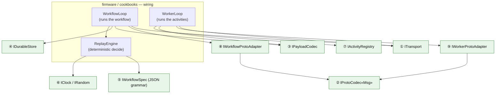

# Contracts — the frozen seams

Reference for contributors and agents extending the worker: the interfaces that
let a desktop and an ESP32 run the same Temporal worker core. If you want to add
a backend — a new transport, a new durable store, or a new set of activities —
without touching the engine, start here. New to the project? Read the
[README](../README.md) first, then [Writing a workflow](writing-a-workflow.md).

The canonical, in-repo source is [`contracts/CONTRACTS.md`](../contracts/CONTRACTS.md)
and the header it describes, [`contracts/include/mwf/contracts.h`](../contracts/include/mwf/contracts.h).
This page is the annotated version: each seam with its signature, **who
implements it (host vs device)**, and **why it exists** as a seam at all.

---

## Why there are contracts

The project is split into independent layers — protobuf, payload codec,
transport, replay engine, durable storage, device I/O. Every layer is written
against a small set of **frozen interfaces**, never against another layer's
implementation. That single decision is what buys three things at once:

- **One core, two targets.** The replay engine, the worker loop, and the
  workflow loop are plain portable C++17. They are compiled unchanged for the
  desktop (against `grpc++` / `libprotobuf` / `nlohmann-json`) and for the
  ESP32-S3 (against a from-scratch `nghttp2`+`mbedTLS` stack / `nanopb` /
  vendored `nlohmann-json`). Only the code *behind* the seams differs.
- **Host-testability.** Every seam has a trivial in-memory or golden-file *fake*,
  so the loops and the engine are exercised in a normal unit test with no radio,
  no TLS, and no protobuf at all.
- **Parallel construction.** Because the seams were frozen *before* the layers
  were built, each layer could be written and tested against golden vectors
  rather than against a live peer.

### Ground rules that apply to every seam

| Rule | What it means |
|---|---|
| **Portable C++17** | No Arduino, no RTOS, no `<google/protobuf>` in the core. The seams are the only vocabulary the engine speaks. |
| **No exceptions across a seam** | Fallible calls return [`mwf::Result<T>`](../contracts/include/mwf/types.h) (`ok`/`value`/`error`), never `throw`. Embedded builds often disable exceptions entirely. |
| **JSON is an alias, not a library** | Core/codec touch only `mwf::json` — `nlohmann::json` on both host and device today (the device build vendors it), selected by a build macro. Where a seam only needs to *pass JSON through*, it does so as `mwf::Bytes` (raw text) so no JSON library is needed on that path at all. |
| **Bytes in, bytes out** | The transport and proto seams move `mwf::Bytes` (protobuf wire) and plain value structs. Nobody downstream of a seam knows what serialization produced them. |
| **Versioned** | `mwf::CONTRACTS_VERSION` (currently **`0.1.1`**). A breaking change to any seam bumps it and is a coordinated event across all layers. |
| **Integration by golden vector** | Layers integrate through recorded fixtures (Temporal histories, captured Payloads, wire captures) under [`conformance/`](../conformance), not live handshakes. Live Mistral is the *final* gate, not the daily one. |

---

## Where the seams sit

There are **nine** seams. Seven are the frozen contracts of
[`contracts.h`](../contracts/include/mwf/contracts.h); the last two are the
per-loop protobuf adapters that live in `core/` (they are *shaped* like the
generated proto codec but specialized for each poll loop, so the loops stay
protobuf-library-free).



Every green node is a seam. Swap the implementation behind it and the boxes above
it never notice.

### The two roles a device can play

A single deployment can run **both** loops, or either one alone. Running both is
the "sole worker": one ESP32-S3 runs the workflow loop and the activity worker
loop against the live Mistral cloud, with no host process anywhere.

- **`WorkerLoop`** — polls the *activity* task queue, decodes the input Payload,
  dispatches to an `IActivityRegistry` handler, encodes the result, responds.
  This is "do a unit of work."
- **`WorkflowLoop`** — polls the *workflow* task queue, feeds the delivered
  history to the deterministic `ReplayEngine`, persists state, and responds with
  the engine's commands (schedule an activity, complete, or fail). This is "drive
  the orchestration."

Here is one workflow tick, annotated with the seams it drives:

```mermaid
sequenceDiagram
  autonumber
  participant Loop as WorkflowLoop
  participant T as ① ITransport
  participant A as ⑧ WorkflowProtoAdapter
  participant C as ③ IPayloadCodec
  participant E as ReplayEngine (⑤/⑥)
  participant D as ④ IDurableStore

  Loop->>A: buildPollWorkflowRequest(cfg)  → bytes
  Loop->>T: call(PollWorkflowTaskQueue, bytes, md, 70s)
  T-->>Loop: response bytes  (or status 4 = idle re-poll)
  Loop->>A: parseWorkflowTask(bytes) → WorkflowTaskInfo{token, ids, History}
  Loop->>C: decode bound activity results in history → inner JSON
  Loop->>D: loadState("exec/<runId>")   (resume after reboot)
  Loop->>E: decide(spec, history, priorState) → Commands + new state
  Loop->>C: encode outbound activity input / workflow result → wf_v1 Payload
  Loop->>D: saveState("exec/<runId>")   BEFORE responding (at-most-once)
  Loop->>A: buildRespondWorkflowCompleted(token, commands) → bytes
  Loop->>T: call(RespondWorkflowTaskCompleted, bytes, md, 10s)
```

A `DEADLINE_EXCEEDED` (gRPC status `4`) on the poll is a normal empty long-poll,
not an error — the loop just re-polls. Persisting state *before* responding is
what makes the run survive a power-cycle mid-execution.

---

## The seams

Signatures below are copied from
[`contracts/include/mwf/contracts.h`](../contracts/include/mwf/contracts.h) and
the two `core/` adapter headers. Where the conceptual shape in `CONTRACTS.md`
differs from the header (JSON shown as `json` vs. carried as `Bytes`), the header
is authoritative and reproduced here.

### ① `ITransport` — one long-poll-aware gRPC unary call

```cpp
struct GrpcResult {
  int         grpc_status = 0;   // 0 OK; 4 DEADLINE_EXCEEDED (empty long-poll, re-poll)
  std::string message;           // grpc-message trailer
  Bytes       response;          // response protobuf bytes; empty on non-OK
};
struct ITransport {
  virtual GrpcResult call(std::string_view fullMethod, const Bytes& requestMsg,
                          const Metadata& metadata, int deadlineMs) = 0;
  virtual void close() = 0;
};
```

- **Implemented by — host:** [`transport/src/desktop_transport.{h,cpp}`](../transport/src/desktop_transport.h)
  over `grpc++` / raw HTTP/2.
- **Implemented by — device:** [`transport/esp/esp_transport.{h,cpp}`](../transport/esp)
  driving a from-scratch gRPC-over-HTTP/2 stack ([`grpc_h2.{h,cpp}`](../transport/esp/grpc_h2.h))
  on `nghttp2` + `mbedTLS` with the TLS session routed to PSRAM.
- **Why the seam:** the entire HTTP/2, TLS, and gRPC-framing problem lives here
  and *only* here. The loops speak `(fullMethod, requestBytes, metadata,
  deadline) → (status, responseBytes)` — they never see a socket, a header
  frame, or a `Bearer` token. `metadata` carries `authorization: Bearer <key>`
  and `temporal-namespace`; the transport is free to add or manage auth itself.
  A poll deadline is deliberately long (the seam default is 70 s: the server
  holds a workflow/activity task up to ~60 s), and an empty hold returns cleanly
  as status `4`. The shipped sole worker tunes it down to ~10 s so the
  round-robin turns over faster (see [`architecture.md`](architecture.md) §3).

### ② `IProtoCodec<Msg>` — typed message ⇄ protobuf wire bytes

```cpp
template <class Msg> struct IProtoCodec {
  virtual Bytes encode(const Msg&) = 0;
  virtual bool  decode(const Bytes&, Msg& out) = 0;
};
```

- **Not in `contracts.h` — by design.** It is a *generated* template, realized
  per build in [`proto/gen/proto_codec.h`](../proto/gen/proto_codec.h).
- **Implemented by — host:** `mwf::ProtoCodec<Msg>` over `libprotobuf` (one
  generic adapter covers every generated message, since they all derive from
  `MessageLite`).
- **Implemented by — device:** the `nanopb` twin over `pb_encode` / `pb_decode`
  (see [`proto/gen_nanopb.sh`](../proto/gen_nanopb.sh) and `proto/gen/nanopb-device/`), a
  hand-capped subset sized for flash and RAM.
- **Why the seam:** the core must be protobuf-library-agnostic. `libprotobuf` is
  far too large for an MCU; `nanopb` is too restrictive for the desktop. Both are
  generated from the same `.proto` subset, so the wire is identical while the
  library is a build-time choice. The message closure in scope is the v1 RPC set
  plus everything it references (`Payload`, `Command` + variants, `HistoryEvent`
  + attributes, `TaskQueue`, `WorkflowType`, `Failure`, …). Only a *slice* is
  wired today — **3 of Temporal's 18 workflow command types** and **13 of 61
  history event types** — enough to schedule an activity, complete, and fail.

### ③ `IPayloadCodec` — the Mistral `json/wf_v1` envelope

```cpp
struct DecodedActivityInput { Bytes argument_json; WorkflowContext context; bool empty = false; };
struct IPayloadCodec {
  virtual Result<DecodedActivityInput> decodeActivityInput(const temporal::Payload&) = 0;
  virtual temporal::Payload encodeActivityResult(const Bytes& result_json,
                                                 const WorkflowContext& echoCtx, bool empty) = 0;
};
```

- **Implemented by — both, portable:** `mwf_codec::PayloadCodecV1` in
  [`codec/include/mwf_codec/payload_codec.h`](../codec/include/mwf_codec/payload_codec.h)
  + [`codec/src/payload_codec.cpp`](../codec/src/payload_codec.cpp). One ~100-line
  implementation runs on host and device alike.
- **Why the seam:** everything else in the worker is *vanilla Temporal*; this is
  the one Mistral-specific piece. Mistral wraps each activity payload in a custom
  encoding, `json/wf_v1`, carrying a `WorkflowContext` (namespace, execution id,
  parent/root exec ids, internal tokens) in the Temporal `Payload.metadata` map
  while the inner argument/result stays as **raw JSON in `Payload.data`**. In v1,
  encryption, blob-offload, and compression are all off, so the inner payload is
  a pure JSON passthrough and the codec is a metadata-map transform — no JSON
  library needed on this path (the argument crosses the seam as `Bytes`). The
  byte-exact format, reverse-engineered from the Mistral SDK, is specified in
  [`contracts/spec/codec-wire-format.md`](../contracts/spec/codec-wire-format.md);
  the `WorkflowContext` struct is in
  [`temporal_types.h`](../contracts/include/mwf/temporal_types.h). Isolating it
  here means the rest of the stack would work against a plain Temporal server
  unchanged.

### ④ `IDurableStore` — power-cycle-durable execution state

```cpp
struct IDurableStore {
  virtual bool put(std::string_view key, const Bytes& value) = 0;
  virtual std::optional<Bytes> get(std::string_view key) = 0;
  virtual bool erase(std::string_view key) = 0;
  virtual std::vector<std::string> keys(std::string_view prefix) = 0;
};
```

- **Implemented by — device:** [`firmware/src/durable_store.{h,cpp}`](../firmware/src/durable_store.h)
  — an NVS journal + LittleFS backing, with the portable index logic in
  `durable_store_logic.h`. **No SD card required.**
- **Implemented by — host:** an in-memory / temp-file fake (in the core tests).
- **Why the seam:** durable execution means the run outlives the worker. If the
  board loses power mid-execution, on reboot it re-polls, gets the same history,
  restores its `EngineState`, and provably emits the same next command. The
  engine serializes its resume snapshot under `exec/<runId>` and the task token
  under `token/<runId>` (append-or-replace by key). The storage medium is an
  implementation detail — flash on the device, RAM in a test — so the resume
  logic is tested without any hardware.

### ⑤ `IWorkflowSpec` — the declarative workflow grammar

There is **no vtable** for this seam, on purpose. A workflow is *data*, not
compiled code: a JSON spec that the replay engine interprets.

```jsonc
// WorkflowSpec = { name, input_schema?, output_schema?, steps[] }
// Step (discriminated on "type"):
{ "type": "activity",    "name": "device.echo", "id": "greet", "args_from": "/input" }
{ "type": "sequence",    "steps": [ /* ... */ ] }
{ "type": "conditional", "predicate": {"path": "/results/greet/ok", "op": "eq", "value": true},
                         "true_steps": [ /* ... */ ], "false_steps": [ /* ... */ ] }
{ "type": "complete",    "result_from": "/results/greet" }
```

- **Parsed + validated by:** `parseWorkflowSpec()` in
  [`core/include/mwf_core/workflow_spec.h`](../core/include/mwf_core/workflow_spec.h).
- **Interpreted by:** `ReplayEngine::decide()` in
  [`core/include/mwf_core/replay_engine.h`](../core/include/mwf_core/replay_engine.h).
- **Why the seam — determinism by construction.** A normal Temporal worker runs
  arbitrary user code and relies on the SDK to police determinism (no wall-clock,
  no RNG, no I/O off the history). On an MCU there is no room for a code sandbox.
  So the workflow is reduced to a bounded grammar the engine *interprets*, which
  is deterministic by construction: `decide()` is a pure function of
  `(spec, history[, prior state])`. Source refs (`args_from` / `result_from` /
  predicate `path`) are RFC-6901 JSON Pointers into a bindings document
  `{ "input": …, "results": { "<step id>": … } }`; predicates are total and pure.
  **v1 grammar:** `activity` + `sequence` + `conditional` + `wait_signal` +
  `complete`. **Reserved (parse-error today, grammar frozen for v1.1):**
  `parallel`, `timer`. **Deferred entirely:** `agent`, `memory_op`, `try_except`,
  `loop`, child workflows.

### ⑥ Determinism seams — `IClock` / `IRandom`

```cpp
struct IClock  { virtual uint64_t nowMs() = 0; };  // during replay: recorded event time
struct IRandom { virtual uint64_t next()  = 0; };  // seeded; seed recorded in history
```

- **Injected into:** the `ReplayEngine` constructor.
- **Why the seam:** time and randomness are the *only* two sources of
  nondeterminism a workflow could reach, and in Temporal both must be recorded to
  history and replayed identically on a re-run. Making them explicit seams means
  the engine can *never* accidentally read the live clock: during replay these
  return the recorded value. Activity results — the third nondeterminism source —
  do not need a seam at all; they arrive *only* as history events, never as live
  calls during a decide. In the **v1** grammar the walk never consults the clock
  or RNG; they are wired and reserved for the v1.1 `timer`/random operations.

### ⑦ `IActivityRegistry` — the device's actual work

```cpp
using ActivityFn = std::function<Result<Bytes>(const Bytes& arg_json)>;  // json-as-bytes
struct IActivityRegistry {
  virtual void registerActivity(std::string name, ActivityFn) = 0;
  virtual bool has(std::string_view name) = 0;
  virtual Result<Bytes> invoke(std::string_view name, const Bytes& arg_json) = 0;
};
```

- **Implemented by:** `mwf_core::ActivityRegistry` in
  [`core/include/mwf_core/activity_registry.h`](../core/include/mwf_core/activity_registry.h);
  application code (firmware / cookbooks) registers the real handlers.
- **Why the seam:** this is where the abstract worker meets a specific device.
  An activity is just `(name, jsonIn) → jsonOut` (the classic portable
  tool-registry shape). The `device.echo` handler lives here;
  reading a sensor, toggling a GPIO, or calling an HTTP API are all just
  registered `ActivityFn`s. JSON crosses this seam as `Bytes` so the registry and
  the worker loop need no JSON library. The `WorkerLoop` looks up and invokes by
  name; nothing about the engine or transport changes when you add an activity.

### ⑧ `IWorkflowProtoAdapter` — the workflow loop's protobuf seam

```cpp
struct IWorkflowProtoAdapter {
  virtual mwf::Bytes buildPollWorkflowRequest(const WorkflowConfig&) = 0;
  virtual mwf::Result<WorkflowTaskInfo> parseWorkflowTask(const mwf::Bytes&) = 0;
  virtual mwf::Bytes buildRespondWorkflowCompleted(
      const WorkflowConfig&, const mwf::Bytes& task_token,
      const std::vector<ProtoCommand>&) = 0;
};
```

- **Defined in:** [`core/include/mwf_core/workflow_proto_adapter.h`](../core/include/mwf_core/workflow_proto_adapter.h).
- **Implemented by — host:** `HostWorkflowAdapter`
  ([`transport/example/host_workflow_adapter.h`](../transport/example/host_workflow_adapter.h))
  over `libprotobuf` (via `ProtoCodec<Msg>`).
- **Implemented by — device:** the nanopb twin,
  [`proto/gen/nanopb_workflow_adapter.{h,cpp}`](../proto/gen/nanopb_workflow_adapter.h).
- **Implemented by — test:** a trivial fake that reuses the golden-history JSON
  loader, so the whole `WorkflowLoop` runs in a unit test with **zero protobuf**.
- **Why the seam:** `IProtoCodec<Msg>` (②) converts *one message* at a time, but
  the loop needs whole *requests* built and whole *responses* parsed — including
  translating the protobuf `HistoryEvent` list into the engine's
  [`mwf_core::History`](../core/include/mwf_core/history.h). Rather than let that
  glue leak protobuf types into the loop, this adapter presents the loop with
  plain value structs: `WorkflowTaskInfo` (task token, execution ids,
  `workflow_type`, decoded `History`) in, `ProtoCommand`s (already payload-codec-
  encoded) out. The loop stays byte-and-struct-only, so one `WorkflowLoop`
  compiles for host, device, and test unchanged.

### ⑨ `IWorkerProtoAdapter` — the activity worker loop's protobuf seam

```cpp
struct IWorkerProtoAdapter {
  virtual mwf::Bytes buildPollRequest(const WorkerConfig&) = 0;
  virtual bool parsePollResponse(const mwf::Bytes&, PolledActivityTask& out) = 0;
  virtual mwf::Bytes buildRespondCompleted(const WorkerConfig&, const mwf::Bytes& task_token,
                                           const mwf::temporal::Payload& result) = 0;
  virtual mwf::Bytes buildRespondFailed(const WorkerConfig&, const mwf::Bytes& task_token,
                                        const std::string& message) = 0;
};
```

- **Defined in:** [`core/include/mwf_core/worker_loop.h`](../core/include/mwf_core/worker_loop.h).
- **Implemented by — host:** `HostProtoAdapter`
  ([`transport/example/host_proto_adapter.h`](../transport/example/host_proto_adapter.h)).
- **Implemented by — device:** [`proto/gen/nanopb_worker_adapter.{h,cpp}`](../proto/gen/nanopb_worker_adapter.h).
- **Why the seam:** the exact twin of ⑧, for the *activity* side. It maps
  `PollActivityTaskQueueResponse → PolledActivityTask` (task token, activity name,
  input Payloads, execution ids) and builds the `Poll` /
  `RespondActivityTaskCompleted` / `RespondActivityTaskFailed` requests. Same
  payoff: the `WorkerLoop` is protobuf-library-free and host-testable, and the
  device swaps in the nanopb twin with no change to the loop.

---

## Who implements what

| # | Seam | Host implementation | Device implementation | Shared/portable? |
|---|------|---------------------|-----------------------|------------------|
| ① | `ITransport` | [`desktop_transport`](../transport/src/desktop_transport.h) (grpc++/h2) | [`esp_transport`](../transport/esp) + [`grpc_h2`](../transport/esp/grpc_h2.h) (nghttp2+mbedTLS/PSRAM) | no |
| ② | `IProtoCodec<Msg>` | [`ProtoCodec`](../proto/gen/proto_codec.h) (libprotobuf) | nanopb twin (`proto/gen/nanopb-device/`) | generated from one `.proto` |
| ③ | `IPayloadCodec` | `PayloadCodecV1` | `PayloadCodecV1` | **yes** — [one impl](../codec/include/mwf_codec/payload_codec.h) |
| ④ | `IDurableStore` | in-memory/temp-file fake | [`durable_store`](../firmware/src/durable_store.h) (NVS+LittleFS) | interface portable |
| ⑤ | `IWorkflowSpec` grammar | — (JSON data) | — (JSON data) | **yes** — engine in [`core`](../core/include/mwf_core/replay_engine.h) |
| ⑥ | `IClock` / `IRandom` | test/real clock | RTC/hardware RNG | interface portable |
| ⑦ | `IActivityRegistry` | app-registered handlers | app-registered handlers | **yes** — [`ActivityRegistry`](../core/include/mwf_core/activity_registry.h) |
| ⑧ | `IWorkflowProtoAdapter` | [`HostWorkflowAdapter`](../transport/example/host_workflow_adapter.h) | [`nanopb_workflow_adapter`](../proto/gen/nanopb_workflow_adapter.h) | + a test fake |
| ⑨ | `IWorkerProtoAdapter` | [`HostProtoAdapter`](../transport/example/host_proto_adapter.h) | [`nanopb_worker_adapter`](../proto/gen/nanopb_worker_adapter.h) | + a test fake |

The two poll loops that consume these seams —
[`WorkflowLoop`](../core/include/mwf_core/workflow_loop.h) and
[`WorkerLoop`](../core/include/mwf_core/worker_loop.h) — and the
[`ReplayEngine`](../core/include/mwf_core/replay_engine.h) are **100% shared**:
byte-identical source compiled for both targets.

---

## Stability & versioning

`mwf::CONTRACTS_VERSION` is **`0.1.1`**. The seams are frozen for the v1 slice;
the reserved surfaces (the `parallel`/`timer` grammar, the
`ProtoCommand::StartTimer` kind, the `IClock`/`IRandom` inputs, the
`TimerStarted`/`TimerFired` history events) exist so the v1.1 grammar can land
*without* re-freezing anything. (`wait_signal` and its
`WorkflowExecutionSignaled` event are already wired.) A change that breaks a
seam's shape bumps the version and is coordinated across every layer at once.

What the seams carry **today** is a deliberate working slice, not the whole of
Temporal: 3 of 18 workflow command types, 13 of 61 history event types, 5 worker
RPCs, single-page histories, and workflow start/query still stubbed on the client
side (signal is wired). The interfaces are wide enough for the rest; the
implementations behind them are what grow.

### Related reading

- [`writing-a-workflow.md`](writing-a-workflow.md) — the how-to guide: write a
  spec and activities, run it on desktop, then on a device.
- [`cookbooks/`](../cookbooks/) — runnable workflows that exercise these seams
  end to end.
- [`contracts/CONTRACTS.md`](../contracts/CONTRACTS.md) — the in-repo source of
  truth these interfaces are frozen in, with the milestone→contract map.
- [`architecture.md`](architecture.md) — how the loops, engine, and transport
  compose these seams into a working sole worker.
- [`wire-format.md`](wire-format.md) — the `json/wf_v1` codec behind seam ③, byte
  for byte.
- [`mistral-compatibility.md`](mistral-compatibility.md) — which Mistral / Temporal
  surface the seams carry today, and the breaking-change surface.
- [`limitations.md`](limitations.md) — the honest boundaries of the slice the seams
  currently implement.
- [`../ROADMAP.md`](../ROADMAP.md) — how the reserved seams get filled in.
- [`contracts/spec/codec-wire-format.md`](../contracts/spec/codec-wire-format.md)
  — the byte-exact `json/wf_v1` payload format behind seam ③.
- [`conformance/docs/mistral-deploy-trigger.md`](../conformance/docs/mistral-deploy-trigger.md)
  — how a workflow is registered and triggered on the live Mistral control plane
  (REST) while the data plane runs on these seams (Temporal gRPC).
- [`README.md`](../README.md) — the project overview.
