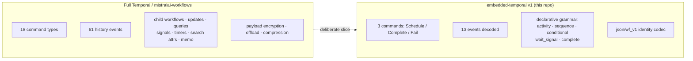
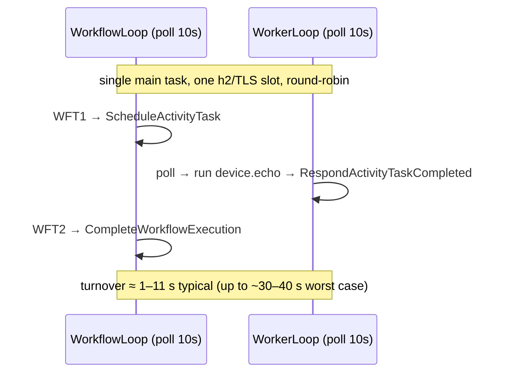

# Limitations

Reference for what `embedded-temporal` v1 does **not** do, why each boundary
exists, and what to do instead — for readers pushing the edges of the grammar or
deciding whether a workflow will fit on the device. New here? Start with the
[README](../README.md) and [Writing a workflow](writing-a-workflow.md).

`embedded-temporal` implements a **working slice** of a Temporal /
[Mistral Workflows](https://docs.mistral.ai/studio-api/workflows/) worker, small
enough to run on a ~$10 microcontroller. It is not a full Temporal SDK.

For the forward plan — how these gaps get closed and in what order — see
[../ROADMAP.md](../ROADMAP.md). The slice was cut from a full feature-surface
gap analysis of the Temporal protocol (121 RPCs / 18 commands / 61 event types).

> **TL;DR** — the device runs a *declarative* workflow (activity / sequence /
> conditional / wait_signal / complete) with `json/wf_v1` payloads, one activity at a time, off
> a single-page history, against the real Mistral cloud. Everything richer than
> that is out of scope for v1 and lives on the roadmap.

---

## Coverage at a glance

The Temporal worker protocol is large; this worker touches a small, load-bearing
corner of it. The numbers below are the concrete slice as implemented (see
[../core/src/workflow_loop.cpp](../core/src/workflow_loop.cpp),
[../core/src/worker_loop.cpp](../core/src/worker_loop.cpp), and
[../proto/gen/nanopb_workflow_adapter.cpp](../proto/gen/nanopb_workflow_adapter.cpp)):

| Surface | Full Temporal | Implemented in v1 | Notes |
|---|---|---|---|
| Worker RPCs | ~8 minimal (121 total) | **5** | `Poll`/`Respond` for both Workflow + Activity task queues |
| Command types | 18 | **3** | `ScheduleActivityTask`, `CompleteWorkflowExecution`, `FailWorkflowExecution` |
| HistoryEvent types decoded | 61 | **13** | lifecycle + activity + timer + signaled (the two `timer` events are decoded but not yet acted on) |
| Workflow grammar | arbitrary code | **5 step kinds** | `activity`, `sequence`, `conditional`, `wait_signal`, `complete` |
| Payload codec | plain / encrypted / offloaded / compressed | **`json/wf_v1` identity only** | no crypto/blob/compression |
| History paging | paged (`GetWorkflowExecutionHistory`) | **single page** | refuses a paged task |
| Client triggers | gRPC + REST | **REST only** | gRPC start/query are stubs; signal is wired |



---

## 1. Workflow grammar — declarative v1 only

A workflow here is **data, not code**: a JSON spec interpreted by a deterministic
replay engine (see [../core/include/mwf_core/workflow_spec.h](../core/include/mwf_core/workflow_spec.h)).
That is what gives determinism-by-construction with **no code sandbox on the
MCU** — but it also means the grammar is a fixed, small vocabulary. Only five step
kinds are interpreted in v1: `activity`, `sequence`, `conditional`, `wait_signal`,
`complete`.

Everything else falls into two buckets, both enforced in the parser
([../core/src/workflow_spec.cpp](../core/src/workflow_spec.cpp)):

- **Reserved (named, parse error today)** — `parallel`, `timer`. A spec that uses
  one is rejected up front with
  `step type '<type>' is reserved for v1.1 — not interpreted by the v1 engine`.
- **Deferred (not even named)** — `agent`, `memory_op`, `try_except`, `loop`.
  These hit the generic `unknown step type '<type>'` error.

| Not supported | Why | Impact / workaround |
|---|---|---|
| **Child workflows** | Needs a new command (`StartChildWorkflowExecution`) + 8 event types + parent/child bookkeeping; not in Mistral's documented surface. | Model the sub-task as an ordinary `activity` on the same device, or split into separate top-level workflows. |
| **`agent`** (LLM/tool loop step) | The Mistral "durable agent" primitive has no stable public contract; it would need in-workflow tool iteration. | Drive the loop from a host, or express fixed steps as `activity` calls that hit the Mistral chat API (see the [`ai-workflow` cookbook](../cookbooks/02-ai-workflow/)). |
| **`memory_op`** (durable memory read/write step) | No grammar/engine support; would need a persistence-backed step type. | Carry state through activity results and the bindings document (`/results/<id>`). |
| **`try_except`** (compensation / error handling) | No branch-on-failure grammar; an activity failure today emits `FailWorkflowExecution` and stops. | Keep activities idempotent and rely on Temporal's server-side activity retry policy; sagas/compensation are roadmap. |
| **`loop`** (bounded iteration) | No looping construct; the engine walks a finite step tree once. | Unroll the iterations in the spec, or re-trigger the workflow per item. |
| **Updates (+ validators)** | Heaviest message-passing primitive: 2 new RPCs (`UpdateWorkflowExecution`, `PollWorkflowExecutionUpdate`) + 4 event types + a validator convention. | Use a REST `signal` + `query`-style pattern from the client instead of a tracked write-and-wait. |
| **Queries** | Needs a distinct query-task path + `RespondQueryTaskCompleted` RPC. | Inspect execution state via the REST management API (`GET /v1/workflows/executions/{id}`) rather than a live query. |

### Reserved primitives (coming in v1.1)

These are *reserved* rather than *deferred* — the wire plumbing partly exists, the
grammar just does not admit them yet:

| Reserved | Current state | Impact / workaround |
|---|---|---|
| **Timers** (`timer`) | `TimerStarted` / `TimerFired` are decoded and a `StartTimer` proto command mapping exists, but a `timer` step is a parse error, so no durable sleep can be authored. | No `workflow.sleep()`-style delay yet; keep steps activity-driven. |
| **Parallel** (`parallel`) | Reserved parse error; the engine schedules **one** activity per tick (see §3). | Express work as a `sequence`; fan-out/join is roadmap. |

---

## 2. Payload codec — `json/wf_v1` identity only

The codec ([../contracts/spec/codec-wire-format.md](../contracts/spec/codec-wire-format.md))
implements exactly the Mistral envelope with **encryption, offloading, and
compression all OFF** — which is the SDK's own default. In that mode
`encoding_options` is empty and the body transform is identity: the inner payload
on the wire is raw JSON.

| Not supported | Why | Impact / workaround |
|---|---|---|
| **Payload encryption** (AES-256-GCM, `FULL` / `FIELD_LEVEL`) | v1 codec body transform is identity; on-device AES-GCM + key management is a v2+ crypto budget. | Run workers/executions with encryption disabled (the default). Do not point the device at a workspace that mandates encrypted payloads. |
| **Payload offloading** (large payloads to S3/GCS/Azure blob) | The device never dereferences a blob pointer; it expects inline JSON in `Payload.data`. | Keep activity inputs/outputs inline and small; stay well under Mistral's 2 MB per-payload limit and the device's RAM budget. |
| **Payload compression** | No decompression path in the identity codec. | Not needed while payloads are small; disabled by default anyway. |
| **Legacy `json/abraxas_v1`** | Decode-only in the SDK; out of v1 scope (only appears for old data). | Only affects pre-existing executions; fresh runs use `json/wf_v1`. |

---

## 3. One outstanding activity per tick

The replay engine ([../core/include/mwf_core/replay_engine.h](../core/include/mwf_core/replay_engine.h))
is v1 = **single outstanding activity**: when the walk reaches an un-scheduled
activity step it emits one `ScheduleActivityTask` and stops. It never fans out
multiple activities in one workflow task.

- **Why:** it keeps the durable-resume state to a single in-flight activity, which
  is what lets a rebooted device match a history suffix's `ActivityTaskCompleted`
  back to its spec step cheaply — no pending-set bookkeeping, minimal RAM.
- **Impact:** no parallelism or fan-out. Each activity is a full
  poll → schedule → execute → complete round trip.
- **Workaround:** compose work as a `sequence`. True parallel fan-out/join is the
  reserved `parallel` step (roadmap).

---

## 4. Single history page — no paging

The device replays a workflow off **one** history page. If a poll response carries
a non-empty `next_page_token`, the proto adapter **refuses the task** rather than
replay a truncated history
([../proto/gen/nanopb_workflow_adapter.cpp](../proto/gen/nanopb_workflow_adapter.cpp)):

```
paged workflow history refused (non-empty next_page_token; v1 assumes single page)
```

- **Why:** replaying a partial history would be non-deterministic and unsafe; and
  `GetWorkflowExecutionHistory` paging plus multi-page reassembly in ~KB of SRAM
  is not implemented. The whole page already decodes into a ~2.56 MB PSRAM buffer
  that is freed between polls.
- **Impact:** workflows whose history grows past a single page (many activities,
  long-running, or high event counts) cannot be replayed on-device. Mistral's hard
  ceiling is 51,200 events / 50 MB, but the practical device page limit is far
  smaller.
- **Workaround:** keep workflows short (a handful of activities). The real fix —
  `Continue-as-New` to cap history growth, and/or `GetWorkflowExecutionHistory`
  paging — is on the roadmap.

---

## 5. Latency — round-robin two-loop (~1–11 s typical, up to ~30–40 s worst case)

The device runs **both** the workflow loop and its one activity worker loop on a
single main task, round-robin over one transport / one TLS arbiter slot (see
[../firmware/src/main.cpp](../firmware/src/main.cpp)). Each loop uses a 10 s
long-poll.



- **Why:** Mistral rejects poll deadlines under 2 s and releases a taskless poll at
  ~the deadline; with two loops sharing one connection, each of the three steps
  (`WFT1 → activity → WFT2`) waits at most one ~10 s poll window. Where each lands
  in its window sets the spread — **measured ~0.9–11 s** wall-clock, ~30–40 s only
  if all three hit the far end (see [esp32-compatibility](esp32-compatibility.md#the-latency-model-round-robin-polling)).
  There is no second worker task competing for the connection.
- **Impact:** this is tuned for **durable/background** execution, not low-latency
  request/response. Compute is sub-second; the wall-clock is poll cadence.
- **Workaround:** accept the latency for durable workflows; it is dominated by
  long-poll cadence, not compute. Tighter latency would need concurrent loops
  and/or sticky execution (roadmap).

---

## 6. Observability & routing gaps

| Not supported | Why | Impact / workaround |
|---|---|---|
| **Search attributes** (`UpsertWorkflowSearchAttributes`) | Needs a new command + a visibility store behind it; not in Mistral's surface. | Cannot tag/index executions for filtered listing. Identify runs by `execution_id` / workflow name instead. |
| **Memo** | Trivial but unimplemented; no attach-metadata command. | No non-indexed metadata on a run. Carry context inside the payload. |
| **Workflow versioning / patching** (`GetVersion` / `Patched`) | Same `RecordMarker` machinery the engine does not yet emit. | The device "versions" by **reflashing** a single firmware image, not by fleet rollout. Don't change a spec while a run is in flight. |
| **Internal-activity SSE fidelity** | The Python SDK posts `POST /v1/workflows/events` per lifecycle step (SSE-consumable) and appends an internal `__parallel_execution__` workflow; the device worker emits **neither**. | Studio's live SSE timeline may show coarser internal detail for device-run workflows. **The workflow still completes** — the Temporal history is the server-of-record and remains authoritative; rely on execution status / history rather than the SSE feed. |
| **Client gRPC start/query** | The device triggers/inspects over the **REST** management API; gRPC `StartWorkflowExecution` / `Query` are stubs (`SignalWorkflowExecution` is wired — it delivers a `wait_signal` approval). | Trigger with `POST /v1/workflows/{name}/execute` and poll `GET /v1/workflows/executions/{id}` (see [../conformance/docs/mistral-deploy-trigger.md](../conformance/docs/mistral-deploy-trigger.md)). |

---

## 7. Hardware requirement

This is **not** a generic ESP32 build. The single-page history decodes into a
~2.56 MB PSRAM buffer (freed between polls) on top of a ~24–28 KB h2/TLS session,
so an **ESP32-S3 with PSRAM** (N8R8 / N16R8 class) is required. Static RAM sits at
14.4% (≈47 KB), flash at 20.1% (≈1.32 MB), resting heap ~255 KB. A
classic ESP32 (no PSRAM) or a smaller-flash part will not fit.

---

## What is *not* a limitation

To avoid confusion — these are working, not gaps:

- **Durable, power-cycle-safe replay.** State is persisted before every respond
  and the deterministic engine re-emits identical commands, so a board that
  reboots mid-execution resumes and completes.
- **Signals / human-in-the-loop.** A `wait_signal` step durably pauses the
  workflow until a signal arrives — a REST call, or a physical button press on the
  device (see [cookbook 04](../cookbooks/04-human-in-the-loop/)).
- **Real Temporal gRPC.** The device speaks the worker-side protocol
  (`Poll`/`Respond` on both task queues) against `wf-scheduler.mistral.ai:443`, not
  a REST shim.
- **Cross-queue activity dispatch** and the `json/wf_v1` context echo.

---

## See also

- [../ROADMAP.md](../ROADMAP.md) — how and in what order each boundary here moves.
- [architecture.md](architecture.md) — the system design these limits fall out of (declarative engine, two loops, one transport).
- [wire-format.md](wire-format.md) — the `json/wf_v1` codec whose identity-only mode §2 describes.
- [mistral-compatibility.md](mistral-compatibility.md) — the same slice, framed as a compatibility + breaking-change contract.
- [contracts.md](contracts.md) — the frozen seams; the reserved surfaces are wired here for v1.1.
- [esp32-compatibility.md](esp32-compatibility.md) — the measured footprint/latency behind §5 and §7.
