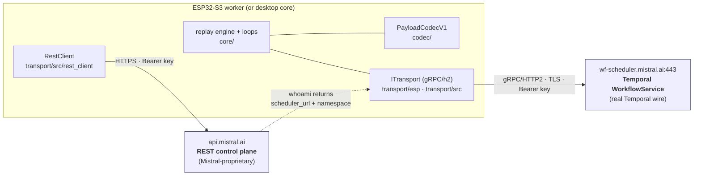

# Mistral Workflows compatibility

Technical reference for super-users and agents who need the exact Mistral /
Temporal wire this worker speaks. New here? Start with the
[README](../README.md), the [Writing a workflow](writing-a-workflow.md) guide,
or a runnable [cookbook](../cookbooks/) — then come back for wire-level detail.

This doc covers which Mistral Workflows / Temporal surface the worker speaks,
where each assumption is pinned in the code, and — because Mistral Workflows is
in public preview and the wire is not a frozen public contract — the
[breaking-change surface](#breaking-change-surface): every place the worker
breaks if Mistral or the underlying Temporal release changes something, which
file owns that assumption, and how to detect and adapt it.

To answer *"will this still work after Mistral's next release?"*, the
breaking-change table is the whole answer.

---

## What "compatible" means here

Mistral Workflows is **durable execution built on Temporal** — Mistral hosts the
orchestrator (a Temporal service) and your code runs as an ordinary Temporal
*worker* against Mistral's frontend. The `mistralai-workflows` Python SDK depends
directly on `temporalio` and runs in this "hybrid mode."

That split gives this worker **two independent compatibility contracts**:

1. **REST control plane** — plain HTTPS against `api.mistral.ai`: worker identity
   (`whoami`), deployment registration (`register`), liveness (`heartbeat`), and
   server-side triggering (`execute`). This is a Mistral-proprietary surface,
   reverse-engineered from the SDK and captured from live traffic.
2. **Temporal gRPC data plane** — real Temporal `WorkflowService` gRPC against
   `wf-scheduler.mistral.ai:443`: the poll/respond task loop and the
   `json/wf_v1` payload envelope. This is genuine Temporal wire, so it is pinned
   to the **vendored `temporalio/api` protobuf descriptors**, not to anything
   Mistral-specific.

This worker deliberately implements a **working slice**, not all of Temporal:
**3 of 18** command types emitted (`ScheduleActivityTask`,
`CompleteWorkflowExecution`, `FailWorkflowExecution`), **13 of 61** `HistoryEvent`
types decoded, **5** worker RPCs (Poll/Respond for Activity + Workflow tasks),
single-page histories only, `json/wf_v1` with encryption/offload/compression off.
Everything below is scoped to that slice.

---

## Supported versions

| Component | Version this worker targets | How it is pinned | How it is verified |
|---|---|---|---|
| **Mistral Workflows** | Public preview (2026) | Not a versioned wire; the REST calls + bodies are frozen from live capture | Live capture against Mistral cloud (see [`conformance/docs/mistral-deploy-trigger.md`](../conformance/docs/mistral-deploy-trigger.md)) |
| **`mistralai-workflows` SDK** | **3.9.0** | Reverse-engineered — codec + register body mirror this exact source revision | Golden vectors + [`conformance/`](../conformance/) oracle |
| **`temporalio` wire** | **1.27.2** (SDK pins `>=1.27.2,<1.28.0`) | Vendored `temporalio/api` protos → [`proto/third_party/temporal-api/`](../proto/third_party/temporal-api/) | Round-trip proto tests + live poll/respond |
| **nanopb** (device codegen) | **0.4.9.1** | Vendored under [`proto/third_party/nanopb/`](../proto/third_party/nanopb/); 1.0.0-dev emits a broken `_Failure_size` macro — do not bump blindly | Device build green |
| **Target hardware** | ESP32-S3 + PSRAM (N8R8 / N16R8 class) | — | On-device run |

The two right-hand columns say how each version is pinned and how it was checked.

---

## The two planes



`whoami` is the bridge: the REST plane hands the worker the gRPC target and
namespace, which the data plane then dials.

### REST control plane (`api.mistral.ai`)

Owner: [`transport/src/rest_client.h`](../transport/src/rest_client.h) /
[`.cpp`](../transport/src/rest_client.cpp). All calls carry
`Authorization: Bearer <MISTRAL_API_KEY>`.

| Call | Purpose | Notes |
|---|---|---|
| `GET /v1/workflows/workers/whoami` | Config discovery | Returns `{scheduler_url, namespace, tls}` — the Temporal frontend to dial. Live: `wf-scheduler.mistral.ai:443`, `tls:true` |
| `POST /v1/workflows/register` | **The deployment** | Metadata-only; flips `workflow.active` and makes the queue dispatchable. `deployment_name` **is** the task queue |
| `POST /v1/workflows/workers/heartbeat` | Liveness (every 10 s) | On 404/405 the SDK disables heartbeat and re-`POST /register` every 10 s instead. **Not required for dispatch** — a registered workflow dispatches without any heartbeat (probe-verified) |
| `POST /v1/workflows/{name}/execute` | Server-side trigger | `{"input": {...}, "task_queue": "<queue>"}`; returns `{execution_id (64-hex), status, ...}`. The client-side gRPC start path is a stub — triggering goes through REST |
| `GET /v1/workflows/executions/{id}` | Poll run status/result | `status ∈ {RUNNING, COMPLETED, FAILED, TERMINATED, TIMED_OUT, CANCELED}` |
| `GET /v1/workflows/{name}` | Worker-liveness gate | `workflow.active` |

`whoami` response shape (live, redacted):

```json
{
  "scheduler_url": "wf-scheduler.mistral.ai:443",
  "namespace": "<customer-uuid>:<workspace-uuid>",
  "tls": true
}
```

**Captured `POST /v1/workflows/register` body** (the exact minimal shape a live
`run_worker()` sends, lifted into the sole-worker probe and into
`RestClient::registerWorkflow`):

```json
{
  "definitions": [
    {
      "name": "mwf_sole_probe",
      "task_queue": "mwf-sole-probe",
      "input_schema":  { "type": "object",
        "properties": { "name":   { "type": "string", "title": "Name"   } },
        "required": ["name"],   "additionalProperties": false, "title": "run_Input" },
      "output_schema": { "type": "object",
        "properties": { "result": { "type": "string", "title": "Result" } },
        "required": ["result"], "title": "run_Output" },
      "signals": [], "queries": [], "updates": [],
      "enforce_determinism": true,
      "on_behalf_of": false,
      "execution_timeout": "PT1H",
      "plugin_metadata": null, "display_name": null, "description": null,
      "is_technical": false, "schedules": []
    }
  ],
  "deployment_name": "mwf-sole-probe",
  "worker_name": "mwf-sole-probe-worker",
  "deployment_location": { "location_type": "local" }
}
```

Full call sequence, per-run registration, and the live E2E evidence live in
[`conformance/docs/mistral-deploy-trigger.md`](../conformance/docs/mistral-deploy-trigger.md).

### Temporal gRPC data plane (`wf-scheduler.mistral.ai:443`)

Real Temporal `WorkflowService` over gRPC/HTTP-2 + TLS, namespace from `whoami`,
Bearer key as a call credential. The slim service declaration
([`proto/proto/mwf/worker_service.proto`](../proto/proto/mwf/worker_service.proto))
re-uses the vendored Temporal request/response messages, so it is **wire-identical**
to Temporal's real `WorkflowService` for these methods.

Worker RPCs the loop drives (**5**):

- `PollWorkflowTaskQueue` → `RespondWorkflowTaskCompleted`
- `PollActivityTaskQueue` → `RespondActivityTaskCompleted` / `RespondActivityTaskFailed`

`RespondWorkflowTaskFailed` is declared in the slim service proto but **not yet
driven** by the loop — today a bad workflow task simply isn't answered and
retries. Wiring it is a Tier-1 roadmap item (see [../ROADMAP.md](../ROADMAP.md)).

**Commands emitted** by the replay engine (owner:
[`core/src/replay_engine.cpp`](../core/src/replay_engine.cpp) →
[`core/src/workflow_loop.cpp`](../core/src/workflow_loop.cpp)): `ScheduleActivityTask`,
`CompleteWorkflowExecution`, `FailWorkflowExecution`. **History events decoded**
(owner: [`core/src/history.cpp`](../core/src/history.cpp)): 13 arms — the workflow-task,
activity-task, and workflow-execution lifecycle plus the reserved `timer` events
and the `WorkflowExecutionSignaled` event that `wait_signal` consumes. Trimmed
proto arms keep their **original Temporal field numbers**, so omitted arms decode as
skipped unknown fields (see [`proto/README.md`](../proto/README.md)).

DEADLINE_EXCEEDED on a poll is a **normal empty long-poll** (re-poll), not an error;
empty polls also release at ~45 s with gRPC OK + empty body (the server's max empty
hold — a shorter client deadline, e.g. the sole worker's ~10 s, wins) — handle both
idle shapes.

---

## Payload codec: `json/wf_v1`

Activity input/result cross the gRPC wire as a Temporal `Payload` whose
`Payload.metadata` map carries a Mistral `WorkflowContext` and whose `Payload.data`
is **raw JSON**. In v1 (encryption / offload / compression all **off**) the inner
content transform is identity, so there is no crypto burden — the whole "envelope"
is the metadata map.

Owner: [`codec/include/mwf_codec/payload_codec.h`](../codec/include/mwf_codec/payload_codec.h)
(the key constants) + [`codec/src/payload_codec.cpp`](../codec/src/payload_codec.cpp).
Byte-level authority: [`contracts/spec/codec-wire-format.md`](../contracts/spec/codec-wire-format.md).

| metadata key | value | when |
|---|---|---|
| `encoding` | `json/wf_v1` | always |
| `namespace` | context namespace | always |
| `execution_id` | context execution id | always (decode **rejects** an empty value) |
| `encoding_options` | comma-joined options — **empty string in v1** | always |
| `root_workflow_exec_id` / `parent_workflow_exec_id` | context ids | if set |
| `__internal_execution_token` | execution token | if set |
| `__internal_extensions` | `json.dumps(extensions)` | if non-empty |
| `__internal_on_behalf_of` | `true` / `false` | if not null |
| `empty_payload` | single `0x00` byte (truthy) | if the payload is logically empty |

The worker **echoes the same context back** on the result payload so the control
plane can correlate the completion. `json/plain` payloads decode with an empty
context (backward compat); legacy `json/abraxas_v1` is out of v1 scope.

---

## The probe-verified assumption: internal `__` activities are optional

The riskiest assumption here: the Python SDK, on every run,
injects internal lifecycle activities (`register_execution`,
`emit_workflow_started`, …) and appends an internal `__parallel_execution__`
workflow to each registration. **If Mistral's frontend required those internal
activities to be reproduced by the worker, a from-scratch declarative worker could
never complete a run** — it would have to reimplement SDK-private lifecycle
bookkeeping.

[`conformance/probe/sole_worker_probe.py`](../conformance/probe/sole_worker_probe.py)
settled it. It becomes a **raw** `temporalio` worker (no
`mistralai-workflows`, no interceptors), REST-registers a minimal workflow, and
responds to the workflow task with **zero** internal-activity commands — just the
declarative result. Both variants reached `COMPLETED` on Mistral cloud:

| Variant | Commands the worker emitted | Internal activity commands | Final status |
|---|---|---|---|
| `no_activity` | `[COMPLETE_WORKFLOW_EXECUTION]` | **0** | `COMPLETED` |
| `with_activity` | `[SCHEDULE_ACTIVITY_TASK, COMPLETE_WORKFLOW_EXECUTION]` | **0** | `COMPLETED` |

Evidence: [`evidence_no_activity.json`](../conformance/probe/evidence_no_activity.json)
/ [`evidence_with_activity.json`](../conformance/probe/evidence_with_activity.json)
(`VERDICT_declarative_replay_sufficient: true`). The final history for the
activity variant is the clean Temporal lifecycle
(`WORKFLOW_EXECUTION_STARTED → WORKFLOW_TASK_* → ACTIVITY_TASK_{SCHEDULED,STARTED,COMPLETED} → WORKFLOW_EXECUTION_COMPLETED`)
with **no `__internal_` activities anywhere** — pure declarative replay of the
user workflow is sufficient.

**If Mistral makes internal activities mandatory** (e.g. the frontend starts
rejecting completions that never recorded `register_execution`), this assumption
breaks. Detection: the probe stops reaching `COMPLETED`, or live runs sit
`RUNNING` forever on a workflow-task retry loop. Adaptation: the replay engine
([`core/src/replay_engine.cpp`](../core/src/replay_engine.cpp)) would have to
reproduce those internal activity commands / REST lifecycle posts
(`/v1/workflows/executions/register`, `/v1/workflows/events`) as part of replay —
re-run the probe first to learn exactly which ones the frontend now demands.

---

## Breaking-change surface

Each row is an assumption baked into the worker. If Mistral or the underlying
Temporal release changes it, that is where it breaks. **The
[`conformance/`](../conformance/) suite is the tripwire for all of them** — the
golden vectors and the live E2E gate are what catch a wire drift before hardware
does.

| # | Assumption | Owning file(s) | Breaks if Mistral / Temporal… | Detect | Adapt |
|---|---|---|---|---|---|
| 1 | `json/wf_v1` metadata **key names** (`namespace`, `execution_id`, `__internal_execution_token`, `empty_payload`, …) | [`codec/include/mwf_codec/payload_codec.h`](../codec/include/mwf_codec/payload_codec.h) | renames a key, adds a required key, or changes `INTERNAL_METADATA_PREFIX` | Golden payload decode fails; live activity input has an unexpected/missing key; `decodeActivityInput` returns failure | Re-RE `core/temporal/payload_codec.py` at the new SDK version; update the `kKey*` constants + [`codec-wire-format.md`](../contracts/spec/codec-wire-format.md); regenerate goldens |
| 2 | Encoding string is literally `json/wf_v1`; `encoding_options` is **empty** (crypto/offload/compression off) | [`codec/…/payload_codec.h`](../codec/include/mwf_codec/payload_codec.h) `kEncodingWfV1`; [`payload_codec.cpp`](../codec/src/payload_codec.cpp) | bumps the custom format (`json/wf_v2`) or turns on encryption/offload/compression by default | `decodeActivityInput` → "unsupported payload encoding"; `encoding_options` arrives non-empty | Add the new format constant + a real `PayloadEncoder` transform (AES-GCM / blob fetch / decompress) — a v2 codec, not a metadata tweak |
| 3 | `empty_payload` is a single truthy `0x00` byte | [`payload_codec.cpp`](../codec/src/payload_codec.cpp) `emptyPayloadSentinel()` | changes the sentinel semantics | Empty-payload golden mismatch | Mirror the new truthiness rule both directions |
| 4 | `whoami` returns `{scheduler_url, namespace, tls}` (flat) | [`transport/src/rest_client.h`](../transport/src/rest_client.h) `WhoAmI` + [`.cpp`](../transport/src/rest_client.cpp) `whoami()` | renames/nests those fields, or points `scheduler_url` at a non-Temporal endpoint | `whoami()` parse yields empty `scheduler_url` / `namespace`; gRPC dial fails | Update the `WhoAmI` parse (the `raw` field preserves the full body for forward-compat); re-dial the new target |
| 5 | `register` body shape (`definitions[].{name,task_queue,input_schema,output_schema,enforce_determinism,execution_timeout,…}`, `deployment_name==task_queue`, `deployment_location`) | [`rest_client.cpp`](../transport/src/rest_client.cpp) `registerWorkflow`; captured shape in [probe](../conformance/probe/sole_worker_probe.py) `minimal_definition` | adds a required definition field, changes `deployment_location`, or decouples `deployment_name` from the queue | `POST /register` → 4xx; `has_conflicts`; workflow never goes `active` | Re-capture a live `run_worker()` register (traced `httpx`); diff against `minimal_definition`; add the field |
| 6 | `execute` / status shapes: `{input,task_queue}` in, `{execution_id (64-hex), status, result}` out; status enum set | [`rest_client.cpp`](../transport/src/rest_client.cpp) `executeWorkflow` / `getExecution` | renames `execution_id`, adds a status value, or moves `result` | Trigger returns no id; status polling never terminates on an unknown status | Update parse; add the new terminal status to the `TERMINAL` set |
| 7 | Heartbeat cadence 10 s + 404/405 → re-register fallback; **dispatch needs no heartbeat** | [`rest_client.cpp`](../transport/src/rest_client.cpp) `heartbeat`; sole-worker loop | requires heartbeat for dispatch, or changes the cadence/endpoint | Registered workflow stops dispatching without a heartbeat; probe's "active without heartbeat" check flips | Re-enable/retune the heartbeat loop; the SDK's own fallback (re-`register` every 10 s) is the reference behavior |
| 8 | Temporal **proto field numbers** for the poll/respond messages, `Command` + `HistoryEvent` arms — pinned to vendored `temporalio/api` @ 1.27.2 | [`proto/third_party/temporal-api/`](../proto/third_party/temporal-api/) (vendored) → [`proto/gen/`](../proto/gen/); trimmed oneof arms in [`proto/README.md`](../proto/README.md) | ships a Temporal release that renumbers a field or requires a new command/event arm we trimmed | Proto round-trip test fails; live poll returns a history event whose tag is silently skipped and replay stalls | Re-vendor `temporalio/api` at the new tag, re-run [`proto/gen_host.sh`](../proto/gen_host.sh) + [`gen_nanopb.sh`](../proto/gen_nanopb.sh); add the arm at its original field number |
| 9 | `execution_id` (Temporal workflow id) is **required non-empty** on inbound payloads | [`payload_codec.cpp`](../codec/src/payload_codec.cpp) `decodeActivityInput` | starts sending activity input without an `execution_id` metadata value | Decode returns "empty execution_id" failure | Relax the guard only if the echo-back correlation no longer needs it |
| 10 | `task_token` fits the nanopb device cap (~256 B budget; **168 B** observed live) | [`proto/nanopb/mwf.options`](../proto/nanopb/) field caps; [`proto/gen/nanopb_workflow_adapter.cpp`](../proto/gen/nanopb_workflow_adapter.cpp) | issues larger task tokens | Device truncates the token → RespondTask rejected | Raise the nanopb `max_size` cap; re-check the PSRAM/heap budget |
| 11 | **Single history page** — the worker refuses paged workflow tasks | [`core/src/history.cpp`](../core/src/history.cpp) / [`core/src/worker_loop.cpp`](../core/src/worker_loop.cpp) | returns a history with a `next_page_token` (long workflows) | Worker sees a truncated history / a page token it ignores → replay diverges | Implement `GetWorkflowExecutionHistory` paging (an unimplemented RPC today) |
| 12 | **Internal `__` activities are optional** (declarative replay is sufficient) | [`core/src/replay_engine.cpp`](../core/src/replay_engine.cpp); proof in [`conformance/probe/`](../conformance/probe/) | requires the SDK's internal lifecycle activities to be reproduced | Probe stops reaching `COMPLETED`; live runs stick `RUNNING` on a workflow-task retry loop | See [the section above](#the-probe-verified-assumption-internal-__-activities-are-optional) — replay must reproduce the internal activity commands / lifecycle REST posts |

---

## Re-pinning playbook (when Mistral or `temporalio` bumps)

When a new `mistralai-workflows` / `temporalio` release lands, do **not** trust a
green compile. Walk the tripwires in order:

1. **Run the conformance oracle** ([`conformance/`](../conformance/)) against the
   new SDK version — regenerate goldens and diff. A metadata-key or format change
   (rows 1–3, 8–10) surfaces here first, offline, before any hardware.
2. **Re-run the live deploy/trigger capture**
   ([`conformance/docs/mistral-deploy-trigger.md`](../conformance/docs/mistral-deploy-trigger.md))
   with a traced `httpx` transport. Diff `whoami`, the `register` body, and the
   `execute`/status shapes (rows 4–7).
3. **Re-run the sole-worker probe**
   ([`conformance/probe/sole_worker_probe.py`](../conformance/probe/sole_worker_probe.py),
   both `--with-activity` and not). If either variant stops reaching `COMPLETED`,
   the internal-activities-optional bet (row 12) has moved.
4. **Re-vendor the Temporal protos** only if `temporalio` crossed a minor
   (the SDK pins `<1.28.0`): re-checkout `temporalio/api` at the matching tag under
   [`proto/third_party/temporal-api/`](../proto/third_party/temporal-api/), re-run
   the codegen scripts, and confirm the proto round-trip test stays green (row 8).
   Keep nanopb at **0.4.9.1** unless you have re-validated the `_Failure_size`
   macro.
5. **Then** flash and run a live workflow to `COMPLETED` end-to-end. Compiling and
   booting is not verification.

---

## See also

- [`wire-format.md`](wire-format.md) — the `json/wf_v1` payload codec in byte-level detail.
- [`architecture.md`](architecture.md) — how the two planes wire into the poll loops and replay engine.
- [`contracts.md`](contracts.md) — the frozen seams behind each compatibility assumption.
- [`limitations.md`](limitations.md) — the honest boundaries of the implemented slice.
- [`esp32-compatibility.md`](esp32-compatibility.md) — measured on-device footprint & latency.
- [`../ROADMAP.md`](../ROADMAP.md) — how the slice grows toward more of Temporal.
- [`conformance/docs/mistral-deploy-trigger.md`](../conformance/docs/mistral-deploy-trigger.md) — the live control/data-plane capture backing every claim here.
