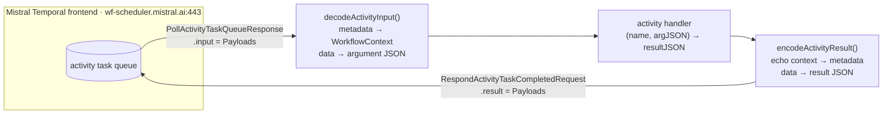
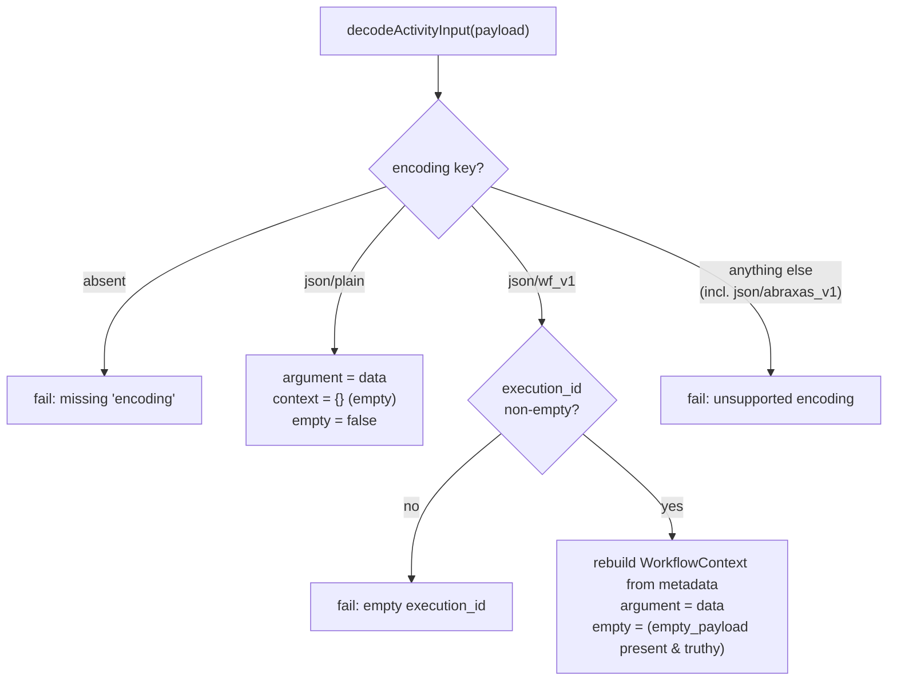

# Wire format — the `json/wf_v1` payload codec

How workflow and activity data crosses the wire between a worker and Mistral's
Temporal frontend, and exactly what an embedded worker must reproduce byte-for-byte.

For people porting or debugging a worker's payload codec. If you only want to
write and run workflows you don't need any of this — start with the
[README](../README.md) and [Writing a workflow](writing-a-workflow.md); this is
the byte-level layer underneath them.

> **TL;DR.** Every argument and result travels inside a Temporal `Payload`
> (`{metadata, data}`). Mistral wraps it with a custom encoding named
> **`json/wf_v1`**: the inner `data` is **raw JSON bytes**, and a small
> **`WorkflowContext`** rides along in `Payload.metadata`. In v1 —
> encryption, offloading, and compression all **off** — encode/decode of the
> body is **identity**: no cryptography, and nothing to reverse-engineer. The
> whole codec is a metadata-map read/write plus a byte passthrough (~100 lines,
> [`codec/src/payload_codec.cpp`](../codec/src/payload_codec.cpp)).

This document is the readable companion to the byte-level authority,
[`contracts/spec/codec-wire-format.md`](../contracts/spec/codec-wire-format.md).
When the two disagree, the spec wins.

---

## 1. Where payloads appear

Mistral Workflows is hosted Temporal. The **control plane** (register/trigger)
is REST over `https://api.mistral.ai`; the **data plane** is real Temporal gRPC
against `wf-scheduler.mistral.ai:443` (see
[`conformance/docs/mistral-deploy-trigger.md`](../conformance/docs/mistral-deploy-trigger.md)).
Payloads live on the data plane: they are the `input` an activity task carries
in, and the `result` a completion carries back out.



The codec is the seam between the transport (protobuf `Payload` bytes) and the
activity handler (JSON in, JSON out). It does **not** touch HTTP/2, protobuf, or
the JSON body's contents — it only reads and writes the metadata map and hands
the body through as opaque bytes.

---

## 2. The Temporal `Payload`

A Temporal `Payload` is a two-field message
([`contracts/include/mwf/temporal_types.h`](../contracts/include/mwf/temporal_types.h)):

```cpp
// mirror of temporal.api.common.v1.Payload
struct Payload {
  Metadata metadata;   // map<string, bytes> — the wf_v1 envelope lives here
  Bytes    data;       // inner payload bytes = raw JSON in v1
};
```

where the portable aliases ([`types.h`](../contracts/include/mwf/types.h)) are:

```cpp
using Bytes    = std::vector<uint8_t>;
using Metadata = std::map<std::string, std::string>;  // values hold raw bytes
```

Two things to keep straight:

- **Metadata values are bytes, not text.** Protobuf types the map as
  `map<string, bytes>`. Most values happen to be ASCII (`json/wf_v1`, a UUID
  pair), but at least one is a raw control byte — see the `empty_payload`
  sentinel in [§6](#6-the-empty_payload-0x00-sentinel-gotcha). Captures store
  each value base64-encoded for exactly this reason.
- **`data` is the JSON body verbatim.** In v1 the codec never re-serializes it;
  the exact bytes that arrived are the exact bytes handed to the handler, and
  vice versa. This is a determinism guarantee, not just an optimization
  ([§9](#9-why-the-body-stays-opaque-bytes)).

---

## 3. The `json/wf_v1` metadata envelope

A Mistral custom-encoded `Payload` sets the following metadata keys. The
constants are defined in
[`codec/include/mwf_codec/payload_codec.h`](../codec/include/mwf_codec/payload_codec.h)
(`INTERNAL_METADATA_PREFIX = "__internal_"`).

| metadata key | value (bytes) | present when |
|---|---|---|
| `encoding` | `json/wf_v1` | **always** (decode requires it) |
| `namespace` | `ctx.ns` — `<customer-uuid>:<workspace-uuid>` | **always** (may be empty) |
| `execution_id` | `ctx.execution_id` | **always** — decode **rejects** if missing/empty |
| `encoding_options` | comma-joined option values — **empty string in v1** | **always** |
| `root_workflow_exec_id` | `ctx.root_workflow_exec_id` | if set |
| `parent_workflow_exec_id` | `ctx.parent_workflow_exec_id` | if set |
| `__internal_execution_token` | `ctx.execution_token` | if set |
| `__internal_extensions` | `json.dumps(ctx.extensions)` | if **non-empty** |
| `__internal_on_behalf_of` | `true` / `false` (string literal) | if not `None` |
| `empty_payload` | a single `0x00` byte (truthy) | if the payload is logically empty |

`data` = the inner payload bytes (raw JSON in v1).

Notes that bite:

- **`encoding_options` is always present, and empty in v1.** It is the switch
  for encryption / offload / compression ([§8](#8-what-changes-under-v2)); with
  all three off, the comma-join of zero options is the empty string `""`.
- **`__internal_on_behalf_of` is the string `"true"`/`"false"`**, not a
  bytes-encoded boolean. Decode compares `value == "true"`.
- **`__internal_extensions` is already-serialized JSON** (`json.dumps` of the
  extensions map). An empty extensions map omits the key entirely.
- **`__internal_execution_token` ≠ the Temporal task token.** The execution
  token is a Mistral context field; the Temporal task token is a separate opaque
  blob that rides the RPC (`RespondActivityTaskCompletedRequest.task_token`,
  ~168 bytes on live Mistral cloud) and never appears in the payload.

---

## 4. The `WorkflowContext` struct

The wire-relevant context the worker reconstructs on decode and echoes on encode
([`contracts/include/mwf/temporal_types.h`](../contracts/include/mwf/temporal_types.h)):

```cpp
struct WorkflowContext {
  std::string ns;                                 // "namespace" (reserved word); required on wire, may be ""
  std::string execution_id;                       // required; decode fails if empty
  std::optional<std::string> root_workflow_exec_id;
  std::optional<std::string> parent_workflow_exec_id;
  std::optional<std::string> execution_token;
  std::optional<std::string> extensions_json;     // json.dumps(extensions); empty ⇒ omit
  std::optional<bool>        on_behalf_of;
};
```

The C++ worker carries `extensions` as the **already-serialized string**
(`extensions_json`), not a parsed map — the codec never needs to look inside it,
so it stays a JSON-lib-agnostic byte blob. The base Mistral model also has a
`retention_ttl` field, but the SDK's metadata builder does **not** write it to
the wire, so it is deliberately absent here.

The `DecodedActivityInput` the codec produces bundles the body, the context, and
the empty flag:

```cpp
struct DecodedActivityInput {
  Bytes           argument_json;  // raw JSON body (v1 identity passthrough)
  WorkflowContext context;
  bool            empty;
};
```

---

## 5. Encode / decode semantics

The codec implements `mwf::IPayloadCodec`
([`CONTRACTS.md §3`](../contracts/CONTRACTS.md)) with two methods.

### Decode (inbound activity input)

Server → worker. Branch on `encoding`:



- `json/wf_v1` → reconstruct the `WorkflowContext` from metadata, require a
  non-empty `execution_id`, take `argument_json` straight from `data`, and set
  `empty` from the `empty_payload` sentinel.
- `json/plain` → backward-compat ([§7](#7-jsonplain-backward-compat)): treat
  `data` as the raw JSON argument with an **empty** context.
- Anything else (including legacy `json/abraxas_v1`) → failure.

### Encode (outbound activity result)

Worker → server. Serialize the handler's JSON result into `data`, then rebuild
the full `json/wf_v1` metadata map by **echoing the same execution context** the
input carried, so the control plane can correlate the completion:

- Always emit `encoding = json/wf_v1`, `namespace`, `execution_id`,
  `encoding_options = ""`.
- Emit each optional key **only when present** on the context.
- Emit `empty_payload` only when `empty` is true.
- `data` = the result JSON, untouched.

Encode **never** emits `json/plain` or `json/abraxas_v1` — those are decode-only
inputs. A minimal round-trip: a context with only `execution_id = "wf-min"`
(even `namespace` empty) encodes and decodes cleanly.

---

## 6. The `empty_payload` `0x00` sentinel gotcha

The byte a C/C++ port most often gets wrong.

Mistral marks a **logically-empty** payload — an activity that takes or returns
"nothing meaningful" — not by clearing `data`, but by **adding** the
`empty_payload` metadata key with a **truthy bytes** value. The real SDK writes
**one `0x00` byte**. In Python, `bool(b"\x00")` is `True` because the bytes
object is non-empty — the *content* is irrelevant; **presence + non-empty
length** is the whole signal.

```text
empty_payload  =  0x00           # one NUL byte
base64         =  "AA=="         # as captured in the goldens
truthy?        =  yes            # non-empty bytes ⇒ empty payload
```

Two traps for a C/C++ port:

1. **`0x00` is not a string terminator here.** Read the metadata value as a
   length-counted byte string, never a C string — a `strlen`-based check sees
   length 0 and gets the meaning exactly backwards.
2. **`empty` is a flag, not "the body is absent".** The captured
   [`empty-out.json`](../conformance/goldens/payloads/empty-out.json) has
   `empty = true` **and** a `data` of `null` (`"bnVsbA=="`). The flag is
   authoritative; the JSON body can still be a valid literal.

The codec mirrors both directions
([`payload_codec.cpp`](../codec/src/payload_codec.cpp)):

```cpp
// encode: a single 0x00 byte
static const std::string s(1, '\0');
// decode: empty iff the key is present AND its value is non-empty (Python bool(bytes))
out.empty = emptyMd && !emptyMd->empty();
```

---

## 7. `json/plain` backward-compat

Not every payload a worker sees is Mistral-custom. Stock Temporal tooling and
some SDK-internal payloads use Temporal's own `json/plain` encoding, which
carries **no** `WorkflowContext`. The codec accepts it on decode:

- `argument_json` = the whole `data` blob (raw JSON).
- `context` = an empty `WorkflowContext` (no namespace, no execution_id).
- `empty` = false.

`json/plain` is **decode-only**. The worker always answers in `json/wf_v1`.

---

## 8. Legacy `json/abraxas_v1`

`LEGACY_ENCODING_FORMAT = "json/abraxas_v1"` is Mistral's older custom encoding.
In the Python SDK it is decode-only (accepted, never emitted). Our **v1 C++
codec deliberately rejects it** as an unsupported encoding: fresh executions
against current Mistral cloud never produce it, so decoding it is out of v1
scope. If a stream of legacy data ever needs to be read, that is a scoped
addition, not a silent behavior.

---

## 9. Why the body stays opaque bytes

The codec parses **no JSON**. The argument and result cross the `IPayloadCodec`
seam as `Bytes`, and the codec pulls in no JSON library at all. This matters for
two reasons:

- **Portability / footprint.** The core is JSON-lib-agnostic — the same code
  links against `nlohmann/json` on the host and a vendored `nlohmann/json` on
  the ESP32 via the `mwf::json` alias, and the codec never depends on it.
- **Determinism.** Temporal replay compares payloads; re-serializing a body
  (reordered keys, changed whitespace, re-encoded numbers) could make a replay
  diverge from its history. Passing the exact incoming bytes through verbatim
  removes that entire class of nondeterminism. See
  [`docs/architecture.md`](architecture.md) for how this ties into the replay
  engine.

---

## 10. Worked examples (real captures)

These are the golden `Payload`s captured via the real SDK codec (with the
representative placeholder namespace
`00000000-0000-4000-8000-000000000000:11111111-1111-4111-8111-111111111111`),
stored under
[`conformance/goldens/payloads/`](../conformance/goldens/payloads/). Metadata is
shown decoded; on the wire every value is the raw bytes (captures keep both a
base64 `metadata` and a `metadata_decoded` view).

**Activity input — a scalar string argument** ([`greet-in.json`](../conformance/goldens/payloads/greet-in.json)):

```jsonc
metadata (decoded):
  encoding         = "json/wf_v1"
  namespace        = "00000000-…:11111111-…"
  execution_id     = "linear-goldencapture-0001"
  encoding_options = ""
data (utf-8)       = "world"          // a JSON string literal
empty              = false
```

To see the "values are bytes" point, the same three keys **as they sit on the
wire** (base64):

```jsonc
encoding     = "anNvbi93Zl92MQ=="                       // "json/wf_v1"
data_b64     = "IndvcmxkIg=="                           // "\"world\""
execution_id = "bGluZWFyLWdvbGRlbmNhcHR1cmUtMDAwMQ=="   // "linear-goldencapture-0001"
```

**Activity result — a structured object** ([`struct-out.json`](../conformance/goldens/payloads/struct-out.json)):

```jsonc
metadata (decoded):  encoding=json/wf_v1, namespace=…, execution_id=…, encoding_options=""
data (utf-8)       = {"n":8,"kind":"even","halved":4}
empty              = false
```

**Empty result** ([`empty-out.json`](../conformance/goldens/payloads/empty-out.json)) — note the flag **and** a real body:

```jsonc
metadata (decoded):
  encoding=json/wf_v1, namespace=…, execution_id=…, encoding_options=""
  empty_payload = ""        // one NUL byte; base64 "AA=="
data (utf-8)    = "null"
empty           = true
```

One downstream quirk worth knowing: a **by-name** activity's result is delivered
to the calling workflow as the *whole* envelope
(`{"context": …, "payload": …, "empty": …}`) rather than the bare `payload`,
because that SDK path skips the result-unwrap step (see
[deploy/trigger §3](../conformance/docs/mistral-deploy-trigger.md)).

---

## 11. Conformance

The codec is validated two ways, both host-run:

- **Synthetic spec vectors** —
  [`codec/test/test_payload_codec.cpp`](../codec/test/test_payload_codec.cpp)
  asserts the exact metadata keys/values, optional-key omission, the
  `on_behalf_of` string form, the `empty_payload` NUL sentinel, decode
  validation (reject missing `encoding`, missing/empty `execution_id`, legacy
  `abraxas`), `json/plain` compat, and full round-trips.
- **Real captured payloads** —
  [`codec/test/test_goldens.cpp`](../codec/test/test_goldens.cpp) base64-decodes
  each golden into a wire `Payload`, decodes it, re-encodes from the
  reconstructed context, and asserts the metadata map **and** `data` reproduce
  the capture **byte-for-byte** in both directions. It self-skips cleanly when no
  captures are present.

Byte-for-byte parity is on the metadata *map* and the `data` bytes — map key
ordering is irrelevant (it is keyed storage, not a sequence).

---

## 12. What changes under v2

v1 is defined by three switches being **off**. Turning any on changes the wire —
but only the inner-content transform and `encoding_options`; the metadata
envelope shape above is unchanged.

| feature (v2+) | `encoding_options` gains | body transform | device cost |
|---|---|---|---|
| **Encryption** (`binary/encrypted`, AES-GCM) | an encrypt option value | `data` becomes ciphertext; `encode/decode_payload_content` stop being identity | key material + AES-GCM (feasible on mbedTLS) |
| **Offloading** (blob storage / claim-check) | an offload option value | `data` becomes a blob reference; content is fetched/stored out-of-band | an extra HTTPS round-trip; interacts with the ~2.56 MB PSRAM history budget |
| **Compression** | a compress option value | `data` is compressed bytes | a decompressor in the hot path |

Mechanically: `encoding_options` stops being `""` and becomes the comma-joined
list of active option values, and the codec's identity passthrough is replaced
by a `PayloadEncoder`/decoder chain keyed off those options. Because the
envelope and metadata keys are stable, a v2 codec is an inner-content plug-in,
not a rewrite. All three are **deferred** — see
[`docs/limitations.md`](limitations.md).

---

## See also

- [`contracts/spec/codec-wire-format.md`](../contracts/spec/codec-wire-format.md) — the byte-level authority (SDK RE notes).
- [`contracts/CONTRACTS.md`](../contracts/CONTRACTS.md) — `IPayloadCodec` and the sibling seams.
- [`architecture.md`](architecture.md) — how the codec sits between the transport and the replay engine (§5).
- [`contracts.md`](contracts.md) — `IPayloadCodec` (seam ③) and the other frozen seams, for external readers.
- [`mistral-compatibility.md`](mistral-compatibility.md) — the codec as a compatibility contract + its breaking-change surface.
- [`limitations.md`](limitations.md) — why the codec is identity-only in v1 (no crypto/offload/compression).
- [`codec/README.md`](../codec/README.md) — building and testing the codec.
- [`conformance/docs/mistral-deploy-trigger.md`](../conformance/docs/mistral-deploy-trigger.md) — the control/data-plane flow these payloads ride.
